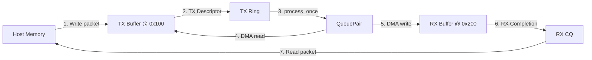
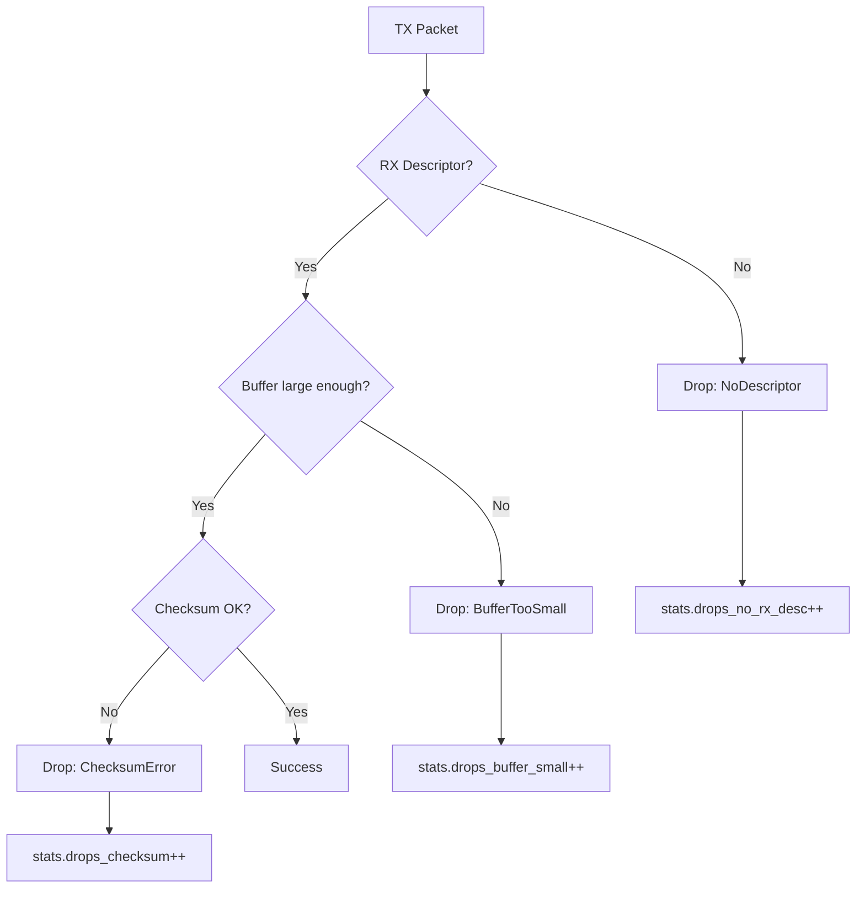
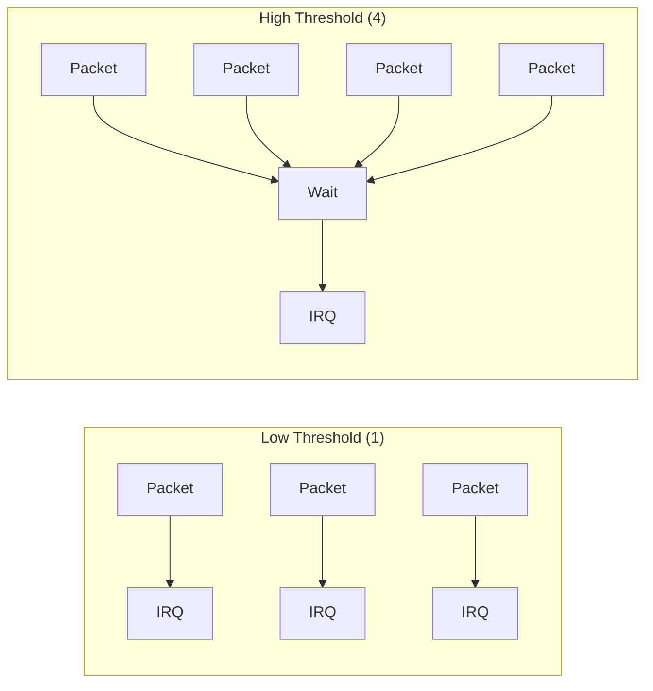
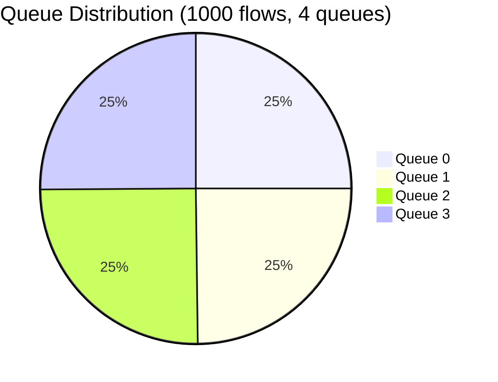

# NIC Simulator Tutorial

A hands-on, step-by-step tutorial for learning hardware modeling through the NIC simulator. Each lesson builds on the previous one.

---

## Prerequisites

Before starting, ensure you can build and run tests:

```bash
cd /path/to/nic
make configure
make build
make test-notrace
```

All tests should pass. If not, check the [CLAUDE.md](../CLAUDE.md) for build requirements.

---

## Tutorial Overview

| Lesson | Topic | Time |
|--------|-------|------|
| 1 | [Your First Packet](#lesson-1-your-first-packet) | 15 min |
| 2 | [Understanding Descriptor Rings](#lesson-2-understanding-descriptor-rings) | 20 min |
| 3 | [Adding DMA Tracing](#lesson-3-adding-dma-tracing) | 25 min |
| 4 | [Implementing Packet Drops](#lesson-4-implementing-packet-drops) | 30 min |
| 5 | [Building a Custom Queue Scheduler](#lesson-5-building-a-custom-queue-scheduler) | 45 min |
| 6 | [Adding a New Hardware Register](#lesson-6-adding-a-new-hardware-register) | 30 min |
| 7 | [Interrupt Coalescing Tuning](#lesson-7-interrupt-coalescing-tuning) | 30 min |
| 8 | [RSS Hash Distribution Analysis](#lesson-8-rss-hash-distribution-analysis) | 30 min |

---

## Lesson 1: Your First Packet

**Goal**: Send a packet through the NIC and verify it arrives correctly.

### Step 1.1: Create the Test File

Create a new file `tests/tutorial_lesson1_test.cpp`:

```cpp
#include "nic/dma_engine.h"
#include "nic/queue_pair.h"
#include "nic/simple_host_memory.h"
#include "nic/trace.h"
#include "nic/tx_rx.h"

#include <cassert>
#include <cstring>
#include <iostream>
#include <vector>

using namespace nic;

int main() {
  NIC_TRACE_SCOPED(__func__);
  std::cout << "=== Lesson 1: Your First Packet ===\n\n";

  // Step 1: Create host memory (simulates system RAM)
  HostMemoryConfig mem_config{
      .size_bytes = 4096,
      .page_size = 64,
      .iommu_enabled = false,
  };
  SimpleHostMemory memory{mem_config};
  std::cout << "1. Created host memory: " << mem_config.size_bytes << " bytes\n";

  // Step 2: Create DMA engine (moves data between NIC and host memory)
  DMAEngine dma{memory};
  std::cout << "2. Created DMA engine\n";

  // Step 3: Configure a queue pair (TX + RX rings)
  QueuePairConfig qp_config{
      .queue_id = 0,
      .tx_ring = {
          .descriptor_size = sizeof(TxDescriptor),
          .ring_size = 4,
          .host_backed = false,
      },
      .rx_ring = {
          .descriptor_size = sizeof(RxDescriptor),
          .ring_size = 4,
          .host_backed = false,
      },
      .tx_completion = {.ring_size = 4},
      .rx_completion = {.ring_size = 4},
  };
  QueuePair qp{qp_config, dma};
  std::cout << "3. Created queue pair with 4-entry rings\n";

  // Step 4: Create a packet in host memory
  std::vector<std::byte> packet(64);
  for (size_t i = 0; i < packet.size(); ++i) {
    packet[i] = std::byte{static_cast<unsigned char>('A' + (i % 26))};
  }

  HostAddress tx_addr = 0x100;  // Where we put the TX packet
  HostAddress rx_addr = 0x200;  // Where we want the RX packet

  auto write_result = memory.write(tx_addr, packet);
  assert(write_result.ok());
  std::cout << "4. Wrote " << packet.size() << " byte packet to address 0x"
            << std::hex << tx_addr << std::dec << "\n";

  // Step 5: Create TX descriptor (tells NIC where packet is)
  TxDescriptor tx_desc{
      .buffer_address = tx_addr,
      .length = static_cast<std::uint32_t>(packet.size()),
      .checksum = ChecksumMode::None,
      .descriptor_index = 0,
  };

  std::vector<std::byte> tx_bytes(sizeof(tx_desc));
  std::memcpy(tx_bytes.data(), &tx_desc, sizeof(tx_desc));
  auto push_result = qp.tx_ring().push_descriptor(tx_bytes);
  assert(push_result.ok());
  std::cout << "5. Pushed TX descriptor to ring\n";

  // Step 6: Create RX descriptor (tells NIC where to put received packet)
  RxDescriptor rx_desc{
      .buffer_address = rx_addr,
      .buffer_length = 128,  // Must be >= packet size
      .descriptor_index = 0,
  };

  std::vector<std::byte> rx_bytes(sizeof(rx_desc));
  std::memcpy(rx_bytes.data(), &rx_desc, sizeof(rx_desc));
  push_result = qp.rx_ring().push_descriptor(rx_bytes);
  assert(push_result.ok());
  std::cout << "6. Pushed RX descriptor to ring\n";

  // Step 7: Process the packet (NIC does its work)
  std::cout << "7. Processing packet...\n";
  bool work_done = qp.process_once();
  assert(work_done);
  std::cout << "   Work done: " << (work_done ? "yes" : "no") << "\n";

  // Step 8: Check completions
  auto tx_cpl = qp.tx_completion().poll_completion();
  auto rx_cpl = qp.rx_completion().poll_completion();

  assert(tx_cpl.has_value());
  assert(rx_cpl.has_value());
  assert(tx_cpl->status == CompletionCode::Success);
  assert(rx_cpl->status == CompletionCode::Success);
  std::cout << "8. TX and RX completions received (both Success)\n";

  // Step 9: Verify the received packet matches
  std::vector<std::byte> received(64);
  auto read_result = memory.read(rx_addr, received);
  assert(read_result.ok());
  assert(received == packet);
  std::cout << "9. Received packet matches sent packet!\n";

  // Step 10: Print statistics
  const auto& stats = qp.stats();
  std::cout << "\n=== Statistics ===\n";
  std::cout << "TX packets: " << stats.tx_packets << "\n";
  std::cout << "RX packets: " << stats.rx_packets << "\n";
  std::cout << "TX bytes:   " << stats.tx_bytes << "\n";
  std::cout << "RX bytes:   " << stats.rx_bytes << "\n";

  std::cout << "\n*** Lesson 1 Complete! ***\n";
  return 0;
}
```

### Step 1.2: Add to CMakeLists.txt

Add to `tests/CMakeLists.txt`:

```cmake
add_executable(tutorial_lesson1_test tutorial_lesson1_test.cpp)
target_link_libraries(tutorial_lesson1_test PRIVATE nic::nic)
add_test(NAME tutorial_lesson1_test COMMAND tutorial_lesson1_test)
```

### Step 1.3: Build and Run

```bash
make build
./build/tests/tutorial_lesson1_test
```

### Expected Output

```
=== Lesson 1: Your First Packet ===

1. Created host memory: 4096 bytes
2. Created DMA engine
3. Created queue pair with 4-entry rings
4. Wrote 64 byte packet to address 0x100
5. Pushed TX descriptor to ring
6. Pushed RX descriptor to ring
7. Processing packet...
   Work done: yes
8. TX and RX completions received (both Success)
9. Received packet matches sent packet!

=== Statistics ===
TX packets: 1
RX packets: 1
TX bytes:   64
RX bytes:   64

*** Lesson 1 Complete! ***
```

### What You Learned



---

## Lesson 2: Understanding Descriptor Rings

**Goal**: Understand how circular buffers work by watching producer/consumer indices.

### Step 2.1: Create the Test File

Create `tests/tutorial_lesson2_test.cpp`:

```cpp
#include "nic/descriptor_ring.h"
#include "nic/dma_engine.h"
#include "nic/simple_host_memory.h"
#include "nic/trace.h"

#include <cassert>
#include <cstring>
#include <iomanip>
#include <iostream>
#include <vector>

using namespace nic;

void print_ring_state(const DescriptorRing& ring, const char* label) {
  std::cout << std::setw(20) << label << ": "
            << "prod=" << ring.producer_index() << " "
            << "cons=" << ring.consumer_index() << " "
            << "avail=" << ring.available() << " "
            << "space=" << ring.space() << " "
            << (ring.is_empty() ? "[EMPTY]" : "")
            << (ring.is_full() ? "[FULL]" : "") << "\n";
}

int main() {
  NIC_TRACE_SCOPED(__func__);
  std::cout << "=== Lesson 2: Understanding Descriptor Rings ===\n\n";

  // Create a small ring (4 slots) for easy visualization
  DescriptorRingConfig config{
      .descriptor_size = 16,  // Simple 16-byte descriptors
      .ring_size = 4,
      .host_backed = false,
  };

  DescriptorRing ring{config};

  std::cout << "Ring created with " << config.ring_size << " slots, "
            << config.descriptor_size << " bytes each\n\n";

  // Dummy descriptor data
  std::vector<std::byte> desc(16, std::byte{0xAA});
  std::vector<std::byte> read_buf(16);

  std::cout << "--- Initial State ---\n";
  print_ring_state(ring, "After creation");

  // Push 3 descriptors (producer advances)
  std::cout << "\n--- Pushing 3 Descriptors ---\n";
  for (int i = 0; i < 3; ++i) {
    desc[0] = std::byte{static_cast<unsigned char>(i)};  // Mark each one
    auto result = ring.push_descriptor(desc);
    assert(result.ok());
    print_ring_state(ring, ("After push " + std::to_string(i + 1)).c_str());
  }

  // Pop 2 descriptors (consumer advances)
  std::cout << "\n--- Popping 2 Descriptors ---\n";
  for (int i = 0; i < 2; ++i) {
    auto result = ring.pop_descriptor(read_buf);
    assert(result.ok());
    print_ring_state(ring, ("After pop " + std::to_string(i + 1)).c_str());
  }

  // Push until full
  std::cout << "\n--- Pushing Until Full ---\n";
  while (!ring.is_full()) {
    auto result = ring.push_descriptor(desc);
    assert(result.ok());
    print_ring_state(ring, "After push");
  }

  // Try to push when full (should still succeed but ring is at capacity)
  std::cout << "\n--- Ring is Full ---\n";
  std::cout << "Available slots: " << ring.space() << "\n";
  std::cout << "Descriptors ready: " << ring.available() << "\n";

  // Pop all remaining
  std::cout << "\n--- Popping All Remaining ---\n";
  while (!ring.is_empty()) {
    auto result = ring.pop_descriptor(read_buf);
    assert(result.ok());
    print_ring_state(ring, "After pop");
  }

  // Demonstrate wraparound
  std::cout << "\n--- Demonstrating Wraparound ---\n";
  std::cout << "Current indices: prod=" << ring.producer_index()
            << " cons=" << ring.consumer_index() << "\n";
  std::cout << "Pushing 2 more (will wrap around)...\n";

  for (int i = 0; i < 2; ++i) {
    ring.push_descriptor(desc);
    print_ring_state(ring, ("Push " + std::to_string(i + 1)).c_str());
  }

  std::cout << "\n*** Lesson 2 Complete! ***\n";
  return 0;
}
```

### Step 2.2: Build and Run

Add to CMakeLists.txt and build:

```bash
make build
./build/tests/tutorial_lesson2_test
```

### Key Insight: Ring Buffer Visualization

```
Initial state (empty):
  +---+---+---+---+
  | . | . | . | . |   prod=0, cons=0, avail=0
  +---+---+---+---+
    ^
   P,C

After 3 pushes:
  +---+---+---+---+
  | X | X | X | . |   prod=3, cons=0, avail=3
  +---+---+---+---+
    ^           ^
    C           P

After 2 pops:
  +---+---+---+---+
  | . | . | X | . |   prod=3, cons=2, avail=1
  +---+---+---+---+
            ^   ^
            C   P

Wraparound:
  +---+---+---+---+
  | X | . | . | X |   prod=1, cons=3, avail=2
  +---+---+---+---+
    ^           ^
    P           C
```

---

## Lesson 3: Adding DMA Tracing

**Goal**: Add custom tracing to understand DMA operations.

### Step 3.1: Create a Tracing Wrapper

Create `tests/tutorial_lesson3_test.cpp`:

```cpp
#include "nic/dma_engine.h"
#include "nic/simple_host_memory.h"
#include "nic/trace.h"

#include <iomanip>
#include <iostream>
#include <vector>

using namespace nic;

// Custom host memory that logs all operations
class TracingHostMemory final : public HostMemory {
public:
  explicit TracingHostMemory(HostMemoryConfig config)
      : config_(config), buffer_(config.size_bytes) {
    std::cout << "[TRACE] Created TracingHostMemory: " << config.size_bytes
              << " bytes\n";
  }

  [[nodiscard]] HostMemoryConfig config() const noexcept override {
    return config_;
  }

  [[nodiscard]] HostMemoryResult translate(HostAddress address, std::size_t length,
                                           HostMemoryView& view) override {
    std::cout << "[TRACE] translate: addr=0x" << std::hex << address << " len="
              << std::dec << length << "\n";

    if (address + length > buffer_.size()) {
      std::cout << "[TRACE]   -> OUT_OF_BOUNDS\n";
      return {HostMemoryError::OutOfBounds, 0};
    }

    view.data = buffer_.data() + address;
    view.length = length;
    view.address = address;
    return {HostMemoryError::None, length};
  }

  [[nodiscard]] HostMemoryResult translate_const(HostAddress address,
                                                  std::size_t length,
                                                  ConstHostMemoryView& view) const override {
    std::cout << "[TRACE] translate_const: addr=0x" << std::hex << address
              << " len=" << std::dec << length << "\n";

    if (address + length > buffer_.size()) {
      return {HostMemoryError::OutOfBounds, 0};
    }

    view.data = buffer_.data() + address;
    view.length = length;
    view.address = address;
    return {HostMemoryError::None, length};
  }

  [[nodiscard]] HostMemoryResult read(HostAddress address,
                                      std::span<std::byte> buffer) const override {
    std::cout << "[TRACE] READ:  addr=0x" << std::hex << std::setfill('0')
              << std::setw(4) << address << " len=" << std::dec << buffer.size();

    if (address + buffer.size() > buffer_.size()) {
      std::cout << " -> OUT_OF_BOUNDS\n";
      return {HostMemoryError::OutOfBounds, 0};
    }

    std::memcpy(buffer.data(), buffer_.data() + address, buffer.size());

    // Show first few bytes
    std::cout << " data=[";
    for (size_t i = 0; i < std::min(buffer.size(), size_t{8}); ++i) {
      std::cout << std::hex << std::setw(2)
                << static_cast<int>(buffer[i]) << " ";
    }
    if (buffer.size() > 8) std::cout << "...";
    std::cout << "]\n" << std::dec;

    return {HostMemoryError::None, buffer.size()};
  }

  [[nodiscard]] HostMemoryResult write(HostAddress address,
                                       std::span<const std::byte> data) override {
    std::cout << "[TRACE] WRITE: addr=0x" << std::hex << std::setfill('0')
              << std::setw(4) << address << " len=" << std::dec << data.size();

    if (address + data.size() > buffer_.size()) {
      std::cout << " -> OUT_OF_BOUNDS\n";
      return {HostMemoryError::OutOfBounds, 0};
    }

    // Show first few bytes
    std::cout << " data=[";
    for (size_t i = 0; i < std::min(data.size(), size_t{8}); ++i) {
      std::cout << std::hex << std::setw(2)
                << static_cast<int>(data[i]) << " ";
    }
    if (data.size() > 8) std::cout << "...";
    std::cout << "]\n" << std::dec;

    std::memcpy(buffer_.data() + address, data.data(), data.size());
    return {HostMemoryError::None, data.size()};
  }

private:
  HostMemoryConfig config_;
  std::vector<std::byte> buffer_;
};

int main() {
  NIC_TRACE_SCOPED(__func__);
  std::cout << "=== Lesson 3: Adding DMA Tracing ===\n\n";

  // Use our tracing memory instead of SimpleHostMemory
  HostMemoryConfig config{.size_bytes = 1024};
  TracingHostMemory memory{config};
  DMAEngine dma{memory};

  std::cout << "\n--- Single Write ---\n";
  std::vector<std::byte> write_data = {
      std::byte{0xDE}, std::byte{0xAD}, std::byte{0xBE}, std::byte{0xEF}};
  dma.write(0x100, write_data);

  std::cout << "\n--- Single Read ---\n";
  std::vector<std::byte> read_data(4);
  dma.read(0x100, read_data);

  std::cout << "\n--- Burst Write (simulated) ---\n";
  std::vector<std::byte> burst_data(32, std::byte{0x42});
  dma.write(0x200, burst_data);

  std::cout << "\n--- Out of Bounds Access ---\n";
  std::vector<std::byte> oob_data(16);
  auto result = dma.read(0x1000, oob_data);  // Beyond 1024 bytes
  std::cout << "Result: " << (result.ok() ? "OK" : "ERROR") << "\n";

  std::cout << "\n--- DMA Counters ---\n";
  const auto& counters = dma.counters();
  std::cout << "Read ops:     " << counters.read_ops << "\n";
  std::cout << "Write ops:    " << counters.write_ops << "\n";
  std::cout << "Bytes read:   " << counters.bytes_read << "\n";
  std::cout << "Bytes written:" << counters.bytes_written << "\n";
  std::cout << "Errors:       " << counters.errors << "\n";

  std::cout << "\n*** Lesson 3 Complete! ***\n";
  return 0;
}
```

### What You Learned

- How to implement the `HostMemory` interface
- Dependency injection pattern (swap implementations)
- DMA operations are traced via the memory interface
- Error handling with result types

---

## Lesson 4: Implementing Packet Drops

**Goal**: Understand drop scenarios by triggering different error conditions.

### Step 4.1: Create the Test File

Create `tests/tutorial_lesson4_test.cpp`:

```cpp
#include "nic/dma_engine.h"
#include "nic/queue_pair.h"
#include "nic/simple_host_memory.h"
#include "nic/trace.h"
#include "nic/tx_rx.h"

#include <cassert>
#include <cstring>
#include <iostream>

using namespace nic;

void setup_basic_qp(SimpleHostMemory& memory, DMAEngine& dma, QueuePair& qp,
                    HostAddress tx_addr, std::size_t packet_size) {
  // Write packet data
  std::vector<std::byte> packet(packet_size, std::byte{0x42});
  memory.write(tx_addr, packet);

  // Push TX descriptor
  TxDescriptor tx_desc{
      .buffer_address = tx_addr,
      .length = static_cast<std::uint32_t>(packet_size),
      .checksum = ChecksumMode::None,
      .descriptor_index = 0,
  };
  std::vector<std::byte> tx_bytes(sizeof(tx_desc));
  std::memcpy(tx_bytes.data(), &tx_desc, sizeof(tx_desc));
  qp.tx_ring().push_descriptor(tx_bytes);
}

int main() {
  NIC_TRACE_SCOPED(__func__);
  std::cout << "=== Lesson 4: Implementing Packet Drops ===\n\n";

  HostMemoryConfig mem_config{.size_bytes = 8192};
  SimpleHostMemory memory{mem_config};
  DMAEngine dma{memory};

  // --- Scenario 1: No RX Descriptor Available ---
  std::cout << "--- Scenario 1: No RX Descriptor (drop) ---\n";
  {
    QueuePairConfig qp_config{
        .queue_id = 0,
        .tx_ring = {.descriptor_size = sizeof(TxDescriptor), .ring_size = 4},
        .rx_ring = {.descriptor_size = sizeof(RxDescriptor), .ring_size = 4},
        .tx_completion = {.ring_size = 4},
        .rx_completion = {.ring_size = 4},
    };
    QueuePair qp{qp_config, dma};

    setup_basic_qp(memory, dma, qp, 0x100, 64);
    // Note: We DON'T push an RX descriptor!

    qp.process_once();

    auto tx_cpl = qp.tx_completion().poll_completion();
    assert(tx_cpl.has_value());
    std::cout << "TX Completion status: "
              << static_cast<int>(tx_cpl->status) << " (";
    switch (tx_cpl->status) {
      case CompletionCode::Success: std::cout << "Success"; break;
      case CompletionCode::NoDescriptor: std::cout << "NoDescriptor"; break;
      default: std::cout << "Other"; break;
    }
    std::cout << ")\n";
    std::cout << "Drops (no RX desc): " << qp.stats().drops_no_rx_desc << "\n\n";
  }

  // --- Scenario 2: RX Buffer Too Small ---
  std::cout << "--- Scenario 2: RX Buffer Too Small (drop) ---\n";
  {
    QueuePairConfig qp_config{
        .queue_id = 1,
        .tx_ring = {.descriptor_size = sizeof(TxDescriptor), .ring_size = 4},
        .rx_ring = {.descriptor_size = sizeof(RxDescriptor), .ring_size = 4},
        .tx_completion = {.ring_size = 4},
        .rx_completion = {.ring_size = 4},
    };
    QueuePair qp{qp_config, dma};

    // Send 100 byte packet
    setup_basic_qp(memory, dma, qp, 0x200, 100);

    // But provide only 50 byte RX buffer
    RxDescriptor rx_desc{
        .buffer_address = 0x300,
        .buffer_length = 50,  // Too small!
        .descriptor_index = 0,
    };
    std::vector<std::byte> rx_bytes(sizeof(rx_desc));
    std::memcpy(rx_bytes.data(), &rx_desc, sizeof(rx_desc));
    qp.rx_ring().push_descriptor(rx_bytes);

    qp.process_once();

    auto rx_cpl = qp.rx_completion().poll_completion();
    if (rx_cpl.has_value()) {
      std::cout << "RX Completion status: "
                << static_cast<int>(rx_cpl->status) << " (";
      switch (rx_cpl->status) {
        case CompletionCode::Success: std::cout << "Success"; break;
        case CompletionCode::BufferTooSmall: std::cout << "BufferTooSmall"; break;
        default: std::cout << "Other"; break;
      }
      std::cout << ")\n";
    }
    std::cout << "Drops (buffer small): " << qp.stats().drops_buffer_small << "\n\n";
  }

  // --- Scenario 3: Successful Transfer ---
  std::cout << "--- Scenario 3: Successful Transfer ---\n";
  {
    QueuePairConfig qp_config{
        .queue_id = 2,
        .tx_ring = {.descriptor_size = sizeof(TxDescriptor), .ring_size = 4},
        .rx_ring = {.descriptor_size = sizeof(RxDescriptor), .ring_size = 4},
        .tx_completion = {.ring_size = 4},
        .rx_completion = {.ring_size = 4},
    };
    QueuePair qp{qp_config, dma};

    setup_basic_qp(memory, dma, qp, 0x400, 64);

    // Provide adequate RX buffer
    RxDescriptor rx_desc{
        .buffer_address = 0x500,
        .buffer_length = 128,  // Plenty of space
        .descriptor_index = 0,
    };
    std::vector<std::byte> rx_bytes(sizeof(rx_desc));
    std::memcpy(rx_bytes.data(), &rx_desc, sizeof(rx_desc));
    qp.rx_ring().push_descriptor(rx_bytes);

    qp.process_once();

    auto tx_cpl = qp.tx_completion().poll_completion();
    auto rx_cpl = qp.rx_completion().poll_completion();

    std::cout << "TX status: " << (tx_cpl->status == CompletionCode::Success ? "Success" : "Error") << "\n";
    std::cout << "RX status: " << (rx_cpl->status == CompletionCode::Success ? "Success" : "Error") << "\n";
    std::cout << "TX packets: " << qp.stats().tx_packets << "\n";
    std::cout << "RX packets: " << qp.stats().rx_packets << "\n";
  }

  std::cout << "\n*** Lesson 4 Complete! ***\n";
  return 0;
}
```

### Drop Scenarios Summary



---

## Lesson 5: Building a Custom Queue Scheduler

**Goal**: Implement a priority-based scheduler instead of round-robin.

### Step 5.1: Create Priority Scheduler

Create `tests/tutorial_lesson5_test.cpp`:

```cpp
#include "nic/dma_engine.h"
#include "nic/queue_pair.h"
#include "nic/simple_host_memory.h"
#include "nic/trace.h"
#include "nic/tx_rx.h"

#include <algorithm>
#include <cassert>
#include <cstring>
#include <iostream>
#include <memory>
#include <vector>

using namespace nic;

// Custom priority scheduler
class PriorityQueueScheduler {
public:
  struct PriorityQueue {
    std::unique_ptr<QueuePair> qp;
    std::uint8_t priority;  // Higher = more important
    std::string name;
  };

  void add_queue(std::unique_ptr<QueuePair> qp, std::uint8_t priority,
                 const std::string& name) {
    queues_.push_back({std::move(qp), priority, name});
    // Sort by priority (highest first)
    std::sort(queues_.begin(), queues_.end(),
              [](const auto& a, const auto& b) {
                return a.priority > b.priority;
              });
  }

  // Process highest priority queue that has work
  bool process_once() {
    for (auto& pq : queues_) {
      if (!pq.qp->tx_ring().is_empty()) {
        std::cout << "  [Scheduler] Processing queue '" << pq.name
                  << "' (priority " << static_cast<int>(pq.priority) << ")\n";
        return pq.qp->process_once();
      }
    }
    return false;  // No work
  }

  QueuePair& get_queue(const std::string& name) {
    for (auto& pq : queues_) {
      if (pq.name == name) return *pq.qp;
    }
    throw std::runtime_error("Queue not found: " + name);
  }

  void print_stats() const {
    std::cout << "\n=== Queue Statistics ===\n";
    for (const auto& pq : queues_) {
      const auto& stats = pq.qp->stats();
      std::cout << "Queue '" << pq.name << "' (pri=" << static_cast<int>(pq.priority)
                << "): TX=" << stats.tx_packets << " RX=" << stats.rx_packets << "\n";
    }
  }

private:
  std::vector<PriorityQueue> queues_;
};

void enqueue_packet(QueuePair& qp, SimpleHostMemory& memory,
                    HostAddress tx_addr, HostAddress rx_addr, std::size_t size) {
  // Write packet
  std::vector<std::byte> packet(size, std::byte{0x42});
  memory.write(tx_addr, packet);

  // TX descriptor
  TxDescriptor tx_desc{.buffer_address = tx_addr,
                       .length = static_cast<std::uint32_t>(size)};
  std::vector<std::byte> tx_bytes(sizeof(tx_desc));
  std::memcpy(tx_bytes.data(), &tx_desc, sizeof(tx_desc));
  qp.tx_ring().push_descriptor(tx_bytes);

  // RX descriptor
  RxDescriptor rx_desc{.buffer_address = rx_addr,
                       .buffer_length = static_cast<std::uint32_t>(size * 2)};
  std::vector<std::byte> rx_bytes(sizeof(rx_desc));
  std::memcpy(rx_bytes.data(), &rx_desc, sizeof(rx_desc));
  qp.rx_ring().push_descriptor(rx_bytes);
}

int main() {
  NIC_TRACE_SCOPED(__func__);
  std::cout << "=== Lesson 5: Priority Queue Scheduler ===\n\n";

  HostMemoryConfig mem_config{.size_bytes = 65536};
  SimpleHostMemory memory{mem_config};
  DMAEngine dma{memory};

  PriorityQueueScheduler scheduler;

  // Create queues with different priorities
  auto make_qp = [&](std::uint16_t id) {
    QueuePairConfig config{
        .queue_id = id,
        .tx_ring = {.descriptor_size = sizeof(TxDescriptor), .ring_size = 8},
        .rx_ring = {.descriptor_size = sizeof(RxDescriptor), .ring_size = 8},
        .tx_completion = {.ring_size = 8},
        .rx_completion = {.ring_size = 8},
    };
    return std::make_unique<QueuePair>(config, dma);
  };

  scheduler.add_queue(make_qp(0), 1, "best-effort");
  scheduler.add_queue(make_qp(1), 5, "video");
  scheduler.add_queue(make_qp(2), 10, "voice");

  std::cout << "Created 3 queues:\n";
  std::cout << "  - 'voice' (priority 10) - highest\n";
  std::cout << "  - 'video' (priority 5)\n";
  std::cout << "  - 'best-effort' (priority 1) - lowest\n\n";

  // Enqueue packets in reverse priority order
  std::cout << "Enqueueing packets (lowest priority first):\n";

  std::cout << "  Enqueue to 'best-effort'\n";
  enqueue_packet(scheduler.get_queue("best-effort"), memory, 0x1000, 0x2000, 64);

  std::cout << "  Enqueue to 'video'\n";
  enqueue_packet(scheduler.get_queue("video"), memory, 0x3000, 0x4000, 64);

  std::cout << "  Enqueue to 'voice'\n";
  enqueue_packet(scheduler.get_queue("voice"), memory, 0x5000, 0x6000, 64);

  // Process - should handle voice first, then video, then best-effort
  std::cout << "\nProcessing (highest priority first):\n";
  while (scheduler.process_once()) {
    // Continue until no work
  }

  scheduler.print_stats();

  std::cout << "\n*** Lesson 5 Complete! ***\n";
  return 0;
}
```

### Expected Output

```
=== Lesson 5: Priority Queue Scheduler ===

Created 3 queues:
  - 'voice' (priority 10) - highest
  - 'video' (priority 5)
  - 'best-effort' (priority 1) - lowest

Enqueueing packets (lowest priority first):
  Enqueue to 'best-effort'
  Enqueue to 'video'
  Enqueue to 'voice'

Processing (highest priority first):
  [Scheduler] Processing queue 'voice' (priority 10)
  [Scheduler] Processing queue 'video' (priority 5)
  [Scheduler] Processing queue 'best-effort' (priority 1)

=== Queue Statistics ===
Queue 'voice' (pri=10): TX=1 RX=1
Queue 'video' (pri=5): TX=1 RX=1
Queue 'best-effort' (pri=1): TX=1 RX=1

*** Lesson 5 Complete! ***
```

---

## Lesson 6: Adding a New Hardware Register

**Goal**: Add a custom register with callback-triggered behavior.

### Step 6.1: Create the Test File

Create `tests/tutorial_lesson6_test.cpp`:

```cpp
#include "nic/register.h"
#include "nic/trace.h"

#include <cassert>
#include <iostream>

using namespace nic;

int main() {
  NIC_TRACE_SCOPED(__func__);
  std::cout << "=== Lesson 6: Adding a New Hardware Register ===\n\n";

  RegisterFile registers;

  // Add standard registers
  std::cout << "--- Adding Registers ---\n";

  // Control register (RW)
  registers.add_register(RegisterDef{
      .name = "CTRL",
      .offset = 0x0000,
      .width = RegisterWidth::Bits32,
      .access = RegisterAccess::RW,
      .reset_value = 0x00000000,
      .write_mask = 0xFFFFFFFF,
  });
  std::cout << "Added CTRL @ 0x0000 (RW)\n";

  // Status register (RO)
  registers.add_register(RegisterDef{
      .name = "STATUS",
      .offset = 0x0004,
      .width = RegisterWidth::Bits32,
      .access = RegisterAccess::RO,
      .reset_value = 0x00000003,  // Link up + speed
      .write_mask = 0x00000000,
  });
  std::cout << "Added STATUS @ 0x0004 (RO)\n";

  // Interrupt Cause (RC - Read-to-Clear)
  registers.add_register(RegisterDef{
      .name = "ICR",
      .offset = 0x0010,
      .width = RegisterWidth::Bits32,
      .access = RegisterAccess::RC,
      .reset_value = 0x00000000,
  });
  std::cout << "Added ICR @ 0x0010 (RC)\n";

  // Interrupt Mask Set (RW1S - Write-1-to-Set)
  registers.add_register(RegisterDef{
      .name = "IMS",
      .offset = 0x0014,
      .width = RegisterWidth::Bits32,
      .access = RegisterAccess::RW1S,
      .reset_value = 0x00000000,
  });
  std::cout << "Added IMS @ 0x0014 (RW1S)\n";

  // Custom packet counter register (RW with callback)
  registers.add_register(RegisterDef{
      .name = "PKT_COUNT",
      .offset = 0x0100,
      .width = RegisterWidth::Bits32,
      .access = RegisterAccess::RW,
      .reset_value = 0x00000000,
  });
  std::cout << "Added PKT_COUNT @ 0x0100 (RW)\n";

  // Reset all registers
  registers.reset();
  std::cout << "\nRegisters reset to defaults\n";

  // Set up callback
  std::cout << "\n--- Setting Up Callback ---\n";
  int callback_count = 0;
  registers.set_write_callback([&](std::uint32_t offset, std::uint64_t old_val,
                                   std::uint64_t new_val) {
    callback_count++;
    std::cout << "  [Callback] Write to 0x" << std::hex << offset
              << ": 0x" << old_val << " -> 0x" << new_val << std::dec << "\n";

    // Special handling for CTRL register bit 0 (reset bit)
    if (offset == 0x0000 && (new_val & 0x01)) {
      std::cout << "  [Callback] RESET triggered!\n";
    }
  });

  // Test RW register
  std::cout << "\n--- Testing RW (CTRL) ---\n";
  std::cout << "Read CTRL: 0x" << std::hex << registers.read32(0x0000) << std::dec << "\n";
  registers.write32(0x0000, 0x12345678);
  std::cout << "Write CTRL: 0x12345678\n";
  std::cout << "Read CTRL: 0x" << std::hex << registers.read32(0x0000) << std::dec << "\n";

  // Test RO register (writes should be ignored)
  std::cout << "\n--- Testing RO (STATUS) ---\n";
  std::cout << "Read STATUS: 0x" << std::hex << registers.read32(0x0004) << std::dec << "\n";
  registers.write32(0x0004, 0xFFFFFFFF);
  std::cout << "Write STATUS: 0xFFFFFFFF (should be ignored)\n";
  std::cout << "Read STATUS: 0x" << std::hex << registers.read32(0x0004) << std::dec << "\n";

  // Test RW1S register
  std::cout << "\n--- Testing RW1S (IMS) ---\n";
  std::cout << "Read IMS: 0x" << std::hex << registers.read32(0x0014) << std::dec << "\n";
  registers.write32(0x0014, 0x0003);  // Set bits 0 and 1
  std::cout << "Write IMS: 0x0003 (set bits 0,1)\n";
  std::cout << "Read IMS: 0x" << std::hex << registers.read32(0x0014) << std::dec << "\n";
  registers.write32(0x0014, 0x0004);  // Set bit 2 (bits 0,1 should stay)
  std::cout << "Write IMS: 0x0004 (set bit 2)\n";
  std::cout << "Read IMS: 0x" << std::hex << registers.read32(0x0014) << std::dec << "\n";

  // Trigger reset via callback
  std::cout << "\n--- Triggering Reset via Callback ---\n";
  registers.write32(0x0000, 0x00000001);  // Set reset bit

  std::cout << "\nTotal callback invocations: " << callback_count << "\n";

  std::cout << "\n*** Lesson 6 Complete! ***\n";
  return 0;
}
```

### Register Access Types Summary

| Access | Read Behavior | Write Behavior |
|--------|---------------|----------------|
| **RO** | Returns value | Ignored |
| **RW** | Returns value | Overwrites value |
| **WO** | Returns 0 | Overwrites value |
| **RC** | Returns value, then clears | Ignored |
| **RW1C** | Returns value | Writing 1 clears that bit |
| **RW1S** | Returns value | Writing 1 sets that bit |

---

## Lesson 7: Interrupt Coalescing Tuning

**Goal**: Experiment with interrupt coalescing to understand throughput vs. latency tradeoffs.

### Step 7.1: Create the Test File

Create `tests/tutorial_lesson7_test.cpp`:

```cpp
#include "nic/interrupt_dispatcher.h"
#include "nic/msix.h"
#include "nic/trace.h"

#include <iostream>
#include <vector>

using namespace nic;

int main() {
  NIC_TRACE_SCOPED(__func__);
  std::cout << "=== Lesson 7: Interrupt Coalescing Tuning ===\n\n";

  // Create MSI-X table with 4 vectors
  MsixTable msix_table{4};
  for (int i = 0; i < 4; ++i) {
    msix_table.set_vector(i, MsixVector{
        .address = 0xFEE00000 + i * 0x10,
        .data = static_cast<std::uint32_t>(0x4000 + i),
        .enabled = true,
        .masked = false,
    });
  }

  // Map queues to vectors
  MsixMapping mapping;
  mapping.queue_to_vector[0] = 0;  // Queue 0 -> Vector 0
  mapping.queue_to_vector[1] = 1;  // Queue 1 -> Vector 1
  mapping.queue_to_vector[2] = 2;  // Queue 2 -> Vector 2
  mapping.queue_to_vector[3] = 3;  // Queue 3 -> Vector 3

  int total_interrupts = 0;
  auto deliver_fn = [&](std::uint16_t vector, std::uint32_t batch_size) {
    total_interrupts++;
    std::cout << "  [IRQ] Vector " << vector << " fired with batch size "
              << batch_size << "\n";
  };

  // --- Scenario 1: No Coalescing (threshold = 1) ---
  std::cout << "--- Scenario 1: No Coalescing (threshold=1) ---\n";
  {
    InterruptDispatcher dispatcher{msix_table, mapping, deliver_fn};
    dispatcher.set_global_coalesce_config(CoalesceConfig{
        .packet_threshold = 1,  // Fire on every packet
    });

    total_interrupts = 0;
    std::cout << "Sending 10 completions:\n";
    for (int i = 0; i < 10; ++i) {
      dispatcher.on_completion(InterruptEvent{.queue_id = 0, .completion_count = 1});
    }
    std::cout << "Total interrupts: " << total_interrupts << "\n\n";
  }

  // --- Scenario 2: Moderate Coalescing (threshold = 4) ---
  std::cout << "--- Scenario 2: Moderate Coalescing (threshold=4) ---\n";
  {
    InterruptDispatcher dispatcher{msix_table, mapping, deliver_fn};
    dispatcher.set_global_coalesce_config(CoalesceConfig{
        .packet_threshold = 4,  // Fire every 4 packets
    });

    total_interrupts = 0;
    std::cout << "Sending 10 completions:\n";
    for (int i = 0; i < 10; ++i) {
      dispatcher.on_completion(InterruptEvent{.queue_id = 0, .completion_count = 1});
    }
    std::cout << "Flushing remaining...\n";
    dispatcher.flush();
    std::cout << "Total interrupts: " << total_interrupts << "\n\n";
  }

  // --- Scenario 3: Aggressive Coalescing (threshold = 8) ---
  std::cout << "--- Scenario 3: Aggressive Coalescing (threshold=8) ---\n";
  {
    InterruptDispatcher dispatcher{msix_table, mapping, deliver_fn};
    dispatcher.set_global_coalesce_config(CoalesceConfig{
        .packet_threshold = 8,  // Fire every 8 packets
    });

    total_interrupts = 0;
    std::cout << "Sending 10 completions:\n";
    for (int i = 0; i < 10; ++i) {
      dispatcher.on_completion(InterruptEvent{.queue_id = 0, .completion_count = 1});
    }
    std::cout << "Flushing remaining...\n";
    dispatcher.flush();
    std::cout << "Total interrupts: " << total_interrupts << "\n\n";
  }

  // --- Scenario 4: Per-Queue Configuration ---
  std::cout << "--- Scenario 4: Per-Queue Configuration ---\n";
  {
    InterruptDispatcher dispatcher{msix_table, mapping, deliver_fn};

    // Queue 0: Low latency (threshold = 1)
    dispatcher.set_queue_coalesce_config(0, CoalesceConfig{.packet_threshold = 1});
    // Queue 1: High throughput (threshold = 8)
    dispatcher.set_queue_coalesce_config(1, CoalesceConfig{.packet_threshold = 8});

    total_interrupts = 0;
    std::cout << "Sending 4 completions to each queue:\n";
    for (int i = 0; i < 4; ++i) {
      std::cout << "  Completion to queue 0 (low-latency):\n";
      dispatcher.on_completion(InterruptEvent{.queue_id = 0, .completion_count = 1});
      std::cout << "  Completion to queue 1 (high-throughput):\n";
      dispatcher.on_completion(InterruptEvent{.queue_id = 1, .completion_count = 1});
    }
    std::cout << "Flushing...\n";
    dispatcher.flush();
    std::cout << "Total interrupts: " << total_interrupts << "\n";
  }

  std::cout << "\n*** Lesson 7 Complete! ***\n";
  return 0;
}
```

### Coalescing Tradeoffs



| Threshold | Interrupts/sec | Latency | CPU Usage |
|-----------|----------------|---------|-----------|
| 1 | High | Low | High |
| 4 | Medium | Medium | Medium |
| 8+ | Low | High | Low |

---

## Lesson 8: RSS Hash Distribution Analysis

**Goal**: Analyze how RSS distributes packets across queues.

### Step 8.1: Create the Test File

Create `tests/tutorial_lesson8_test.cpp`:

```cpp
#include "nic/rss.h"
#include "nic/trace.h"

#include <cstdint>
#include <iomanip>
#include <iostream>
#include <map>
#include <random>
#include <vector>

using namespace nic;

// Simulate packet 5-tuple
struct PacketTuple {
  std::uint32_t src_ip;
  std::uint32_t dst_ip;
  std::uint16_t src_port;
  std::uint16_t dst_port;

  std::vector<std::uint8_t> to_bytes() const {
    std::vector<std::uint8_t> bytes(12);
    bytes[0] = (src_ip >> 24) & 0xFF;
    bytes[1] = (src_ip >> 16) & 0xFF;
    bytes[2] = (src_ip >> 8) & 0xFF;
    bytes[3] = src_ip & 0xFF;
    bytes[4] = (dst_ip >> 24) & 0xFF;
    bytes[5] = (dst_ip >> 16) & 0xFF;
    bytes[6] = (dst_ip >> 8) & 0xFF;
    bytes[7] = dst_ip & 0xFF;
    bytes[8] = (src_port >> 8) & 0xFF;
    bytes[9] = src_port & 0xFF;
    bytes[10] = (dst_port >> 8) & 0xFF;
    bytes[11] = dst_port & 0xFF;
    return bytes;
  }
};

void print_distribution(const std::map<std::uint16_t, int>& dist, int total) {
  std::cout << "Queue distribution:\n";
  for (const auto& [queue, count] : dist) {
    double pct = 100.0 * count / total;
    std::cout << "  Queue " << queue << ": " << std::setw(5) << count
              << " (" << std::fixed << std::setprecision(1) << pct << "%) ";
    int bars = static_cast<int>(pct / 2);
    for (int i = 0; i < bars; ++i) std::cout << "#";
    std::cout << "\n";
  }
}

int main() {
  NIC_TRACE_SCOPED(__func__);
  std::cout << "=== Lesson 8: RSS Hash Distribution Analysis ===\n\n";

  // Standard Microsoft RSS key
  std::vector<std::uint8_t> rss_key = {
      0x6d, 0x5a, 0x56, 0xda, 0x25, 0x5b, 0x0e, 0xc2,
      0x41, 0x67, 0x25, 0x3d, 0x43, 0xa3, 0x8f, 0xb0,
      0xd0, 0xca, 0x2b, 0xcb, 0xae, 0x7b, 0x30, 0xb4,
      0x77, 0xcb, 0x2d, 0xa3, 0x80, 0x30, 0xf2, 0x0c,
      0x6a, 0x42, 0xb7, 0x3b, 0xbe, 0xac, 0x01, 0xfa,
  };

  // --- Test 1: 4 Queues ---
  std::cout << "--- Test 1: 4 Queues, 1000 Flows ---\n";
  {
    RssConfig config;
    config.key = rss_key;
    config.table = {0, 1, 2, 3, 0, 1, 2, 3,
                    0, 1, 2, 3, 0, 1, 2, 3};  // 16-entry table

    RssEngine rss{config};

    std::map<std::uint16_t, int> distribution;
    std::mt19937 gen(42);  // Fixed seed for reproducibility
    std::uniform_int_distribution<std::uint32_t> ip_dist(0, 0xFFFFFFFF);
    std::uniform_int_distribution<std::uint16_t> port_dist(1024, 65535);

    for (int i = 0; i < 1000; ++i) {
      PacketTuple tuple{
          .src_ip = ip_dist(gen),
          .dst_ip = ip_dist(gen),
          .src_port = port_dist(gen),
          .dst_port = port_dist(gen),
      };
      auto bytes = tuple.to_bytes();
      auto queue = rss.select_queue(bytes);
      if (queue) {
        distribution[*queue]++;
      }
    }

    print_distribution(distribution, 1000);
  }

  // --- Test 2: Same Flow Always Goes to Same Queue ---
  std::cout << "\n--- Test 2: Flow Affinity (same flow -> same queue) ---\n";
  {
    RssConfig config;
    config.key = rss_key;
    config.table = {0, 1, 2, 3, 0, 1, 2, 3};

    RssEngine rss{config};

    // Create a specific flow
    PacketTuple flow{
        .src_ip = 0xC0A80164,   // 192.168.1.100
        .dst_ip = 0xC0A80101,   // 192.168.1.1
        .src_port = 8080,
        .dst_port = 80,
    };

    auto bytes = flow.to_bytes();
    auto hash = rss.compute_hash(bytes);

    std::cout << "Flow: 192.168.1.100:8080 -> 192.168.1.1:80\n";
    std::cout << "Hash: 0x" << std::hex << hash << std::dec << "\n";

    // Check 10 times - should always be same queue
    std::cout << "Checking 10 lookups: ";
    auto first_queue = rss.select_queue(bytes);
    bool all_same = true;
    for (int i = 0; i < 10; ++i) {
      auto queue = rss.select_queue(bytes);
      std::cout << *queue << " ";
      if (queue != first_queue) all_same = false;
    }
    std::cout << "\nAll same queue: " << (all_same ? "YES" : "NO") << "\n";
  }

  // --- Test 3: Reverse Flow (bidirectional symmetry) ---
  std::cout << "\n--- Test 3: Bidirectional Flow ---\n";
  {
    RssConfig config;
    config.key = rss_key;
    config.table = {0, 1, 2, 3, 0, 1, 2, 3};

    RssEngine rss{config};

    PacketTuple forward{
        .src_ip = 0xC0A80164,
        .dst_ip = 0xC0A80101,
        .src_port = 8080,
        .dst_port = 80,
    };

    PacketTuple reverse{
        .src_ip = 0xC0A80101,   // Swapped
        .dst_ip = 0xC0A80164,
        .src_port = 80,         // Swapped
        .dst_port = 8080,
    };

    auto fwd_queue = rss.select_queue(forward.to_bytes());
    auto rev_queue = rss.select_queue(reverse.to_bytes());

    std::cout << "Forward (192.168.1.100:8080 -> 192.168.1.1:80): Queue " << *fwd_queue << "\n";
    std::cout << "Reverse (192.168.1.1:80 -> 192.168.1.100:8080): Queue " << *rev_queue << "\n";
    std::cout << "Note: Standard Toeplitz doesn't guarantee symmetry\n";
    std::cout << "(Symmetric RSS requires XOR of src/dst before hashing)\n";
  }

  // --- Test 4: Varying Source Ports ---
  std::cout << "\n--- Test 4: Same IPs, Varying Source Ports ---\n";
  {
    RssConfig config;
    config.key = rss_key;
    config.table = {0, 1, 2, 3, 0, 1, 2, 3};

    RssEngine rss{config};

    std::map<std::uint16_t, int> distribution;

    for (std::uint16_t port = 1024; port < 1024 + 100; ++port) {
      PacketTuple tuple{
          .src_ip = 0xC0A80164,
          .dst_ip = 0xC0A80101,
          .src_port = port,
          .dst_port = 80,
      };
      auto queue = rss.select_queue(tuple.to_bytes());
      if (queue) {
        distribution[*queue]++;
      }
    }

    std::cout << "100 connections from same client to same server:\n";
    print_distribution(distribution, 100);
  }

  std::cout << "\n*** Lesson 8 Complete! ***\n";
  return 0;
}
```

### RSS Distribution Visualization



---

## Next Steps

After completing these tutorials, you can:

1. **Explore the test suite**: `tests/` contains many more examples
2. **Read the user's guide**: `docs/users_guide.md` for deeper explanations
3. **Modify the NIC**: Try adding new features or changing behavior
4. **Build the driver**: `driver/` provides a higher-level API
5. **Profile with Tracy**: `make tracy-profiler` to visualize execution

---

## Quick Reference: Adding Tutorial Tests

To add any tutorial test to the build:

```cmake
# In tests/CMakeLists.txt
add_executable(tutorial_lessonN_test tutorial_lessonN_test.cpp)
target_link_libraries(tutorial_lessonN_test PRIVATE nic::nic)
add_test(NAME tutorial_lessonN_test COMMAND tutorial_lessonN_test)
```

Then:
```bash
make build
./build/tests/tutorial_lessonN_test
```

---

*Happy learning!*
