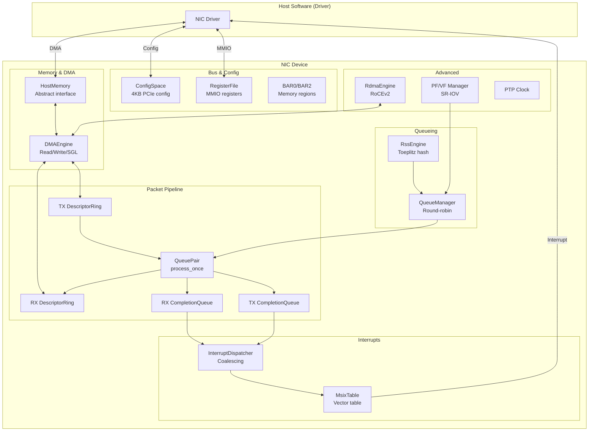
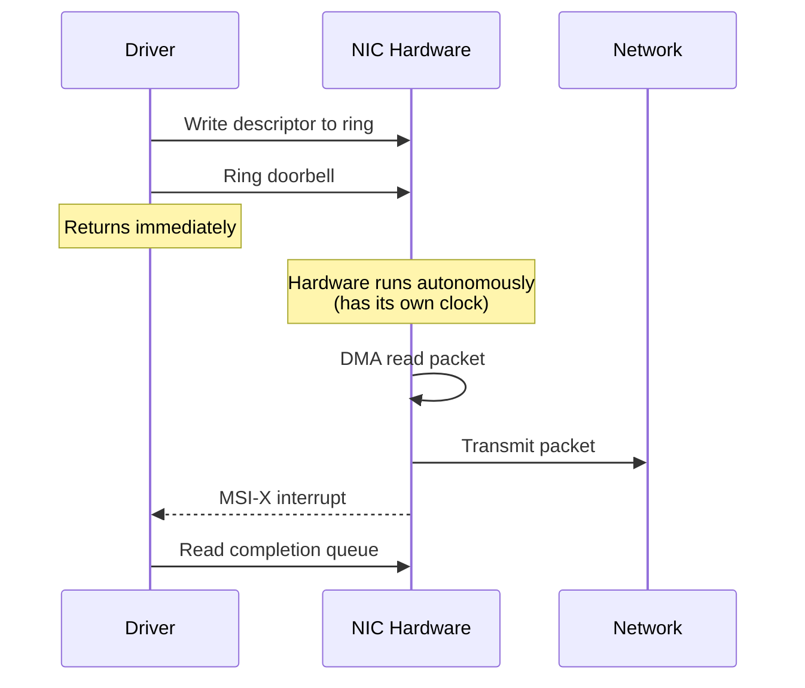
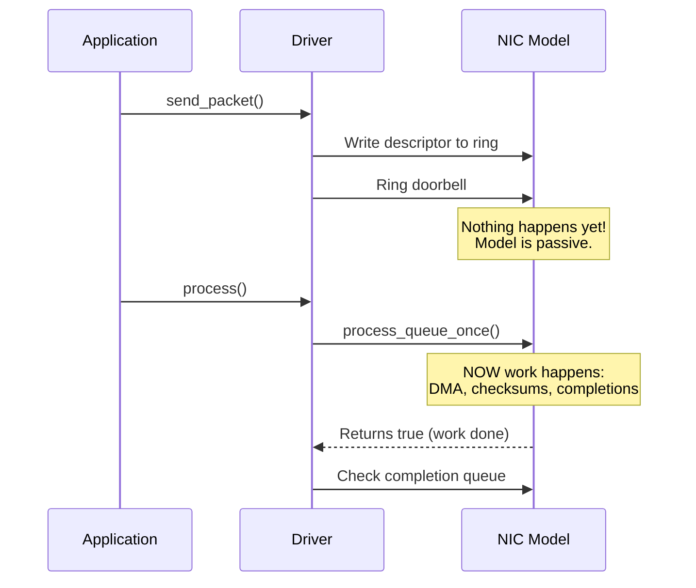
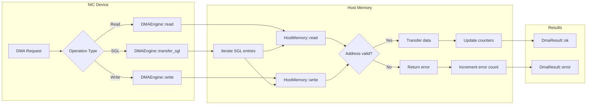
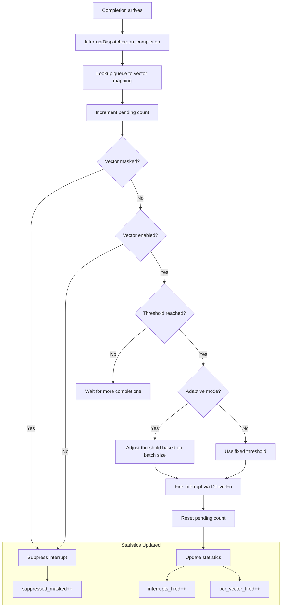
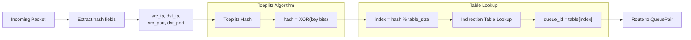
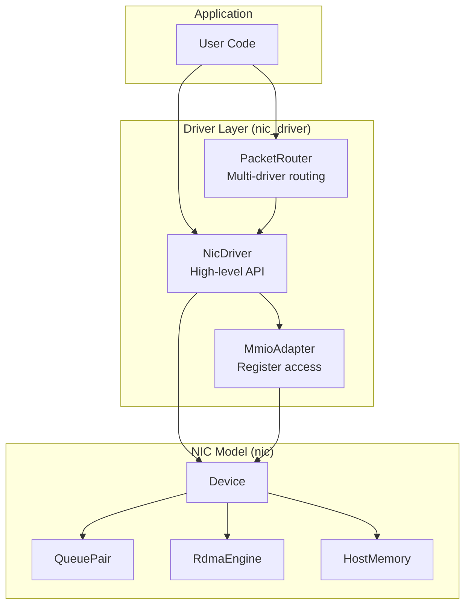
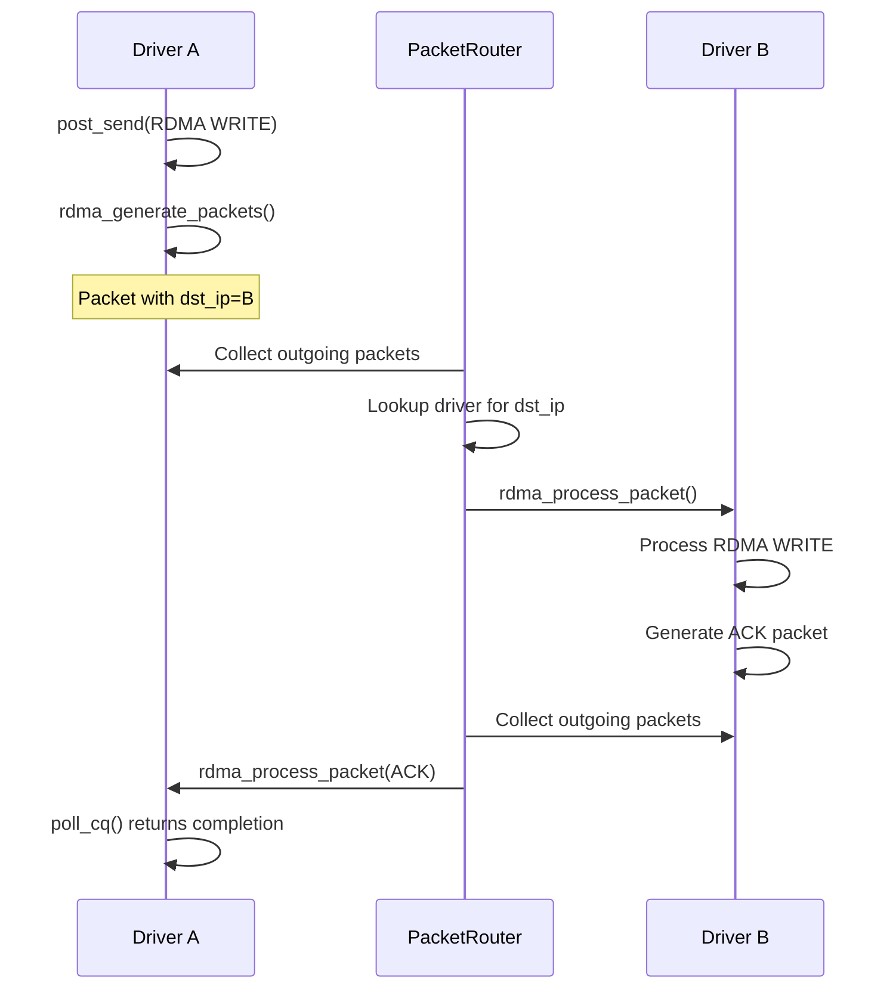
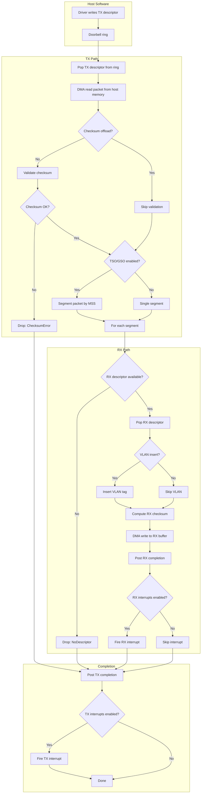
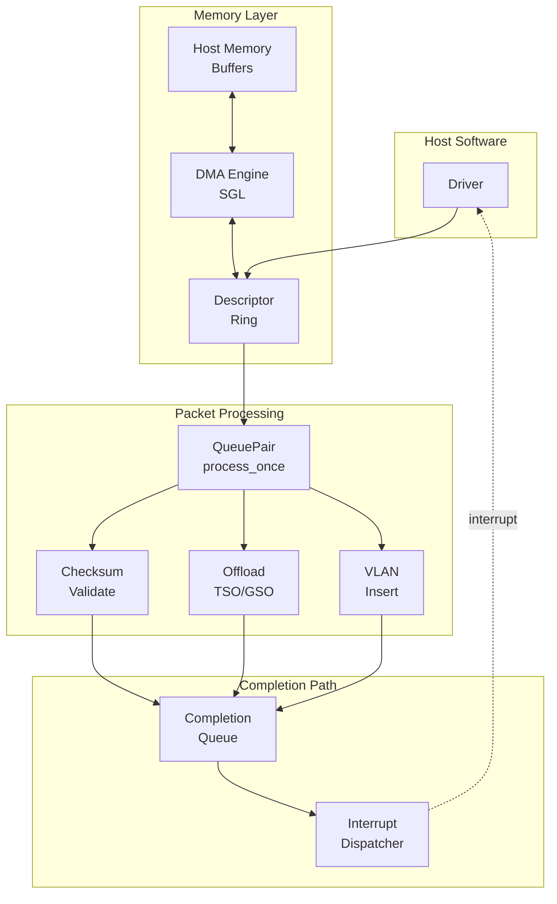

# NIC Simulator User's Guide

A comprehensive guide for engineers learning hardware modeling, networking, and SoC design concepts through this C++20 NIC behavioral simulator.

---

## Table of Contents

1. [Introduction](#1-introduction)
2. [Quick Start](#2-quick-start)
3. [Architecture Overview](#3-architecture-overview)
4. [Networking & Packet Pipeline](#4-networking--packet-pipeline)
5. [Memory & DMA](#5-memory--dma)
6. [PCIe & Device Integration](#6-pcie--device-integration)
7. [Interrupts & Virtualization](#7-interrupts--virtualization)
8. [Receive Side Scaling (RSS)](#8-receive-side-scaling-rss)
9. [C++ Techniques for HW Modeling](#9-c-techniques-for-hw-modeling)
10. [Tracing & Debugging](#10-tracing--debugging)
11. [RoCEv2 RDMA (Advanced)](#11-rocev2-rdma-advanced)
12. [Driver Layer](#12-driver-layer)
13. [Exercises & Next Steps](#13-exercises--next-steps)
14. [Appendix A: Complete Working Examples](#appendix-a-complete-working-examples)
15. [Appendix B: Flow Diagrams](#appendix-b-flow-diagrams)

---

## 1. Introduction

### What is This Project?

This is a **cycle-free behavioral model** of an advanced Ethernet NIC (Network Interface Card) written in modern C++20. Unlike cycle-accurate RTL simulators, this model focuses on functional correctness and algorithmic behavior, making it ideal for:

- Learning NIC architecture and networking concepts
- Driver development and testing
- Protocol validation
- Understanding hardware/software interfaces

### What Will You Learn?

This codebase demonstrates concepts across three hardware engineering domains:

| Domain | Topics Covered |
|--------|----------------|
| **HW Modeling** | Network protocols, schedulers, queues, buffers, pipelining, lookup engines |
| **SoC Design** | Memory semantics, PCIe, DMA engines, interrupt handling, virtualization |
| **C++ Techniques** | Modern C++20 patterns for hardware modeling and simulation |

### Prerequisites

- C++20 knowledge (templates, concepts, ranges)
- Basic understanding of Ethernet networking
- Familiarity with CMake build systems
- Understanding of producer/consumer patterns

### Key Features Modeled

- Multi-queue TX/RX with weighted scheduling
- DMA engine with scatter-gather list support
- Hardware offloads: TSO/GSO, checksum, VLAN
- MSI-X interrupts with coalescing
- SR-IOV virtualization (PF/VF)
- RSS (Receive Side Scaling) with Toeplitz hashing
- RoCEv2 RDMA operations
- PTP time synchronization
- Tracy profiler integration

---

## 2. Quick Start

### Building

```bash
# Configure and build
make configure
make build

# Run tests without Tracy tracing
make test-notrace

# Run tests with Tracy capture (requires tracy-capture built)
make test
```

### Build Options

```bash
# Release build
BUILD_TYPE=Release make configure

# With AddressSanitizer
make asan

# With code coverage
make coverage
```

### Project Structure

```
include/nic/           # Public headers (API)
src/                   # Implementation files
tests/                 # Unit and integration tests
driver/                # High-level driver wrapper
libs/bit_fields/       # Bit field utilities (submodule)
third-party/tracy/     # Tracy profiler (submodule)
docs/                  # Documentation
```

### Running a Specific Test

```bash
ctest --test-dir build -R device_smoke_test --output-on-failure
```

---

## 3. Architecture Overview

### Seven Major Subsystems



### File-to-Subsystem Mapping

| Subsystem | Key Files |
|-----------|-----------|
| Bus & Config | `device.h`, `config_space.h`, `bar.h`, `register.h`, `capability.h`, `pcie_formats.h`, `register_formats.h` |
| Memory & DMA | `host_memory.h`, `dma_engine.h`, `sgl.h`, `dma_types.h` |
| Packet Pipeline | `tx_rx.h`, `queue_pair.h`, `descriptor_ring.h`, `completion_queue.h` |
| Queueing | `queue_manager.h`, `rss.h` |
| Interrupts | `interrupt_dispatcher.h`, `msix.h` |
| Advanced | `virtual_function.h`, `pf_vf_manager.h`, `ptp_clock.h`, `rocev2/*.h` |

### Behavioral Model vs Real Hardware

This simulator is a **behavioral model**, which differs from real hardware in how work gets processed.

#### Real NIC + Real Driver



In a real NIC, the hardware has its own clock. Once you ring the doorbell, the NIC **processes packets autonomously**. The driver just waits for interrupts.

#### Behavioral Model (This Simulator)



The model is **inert** - nothing happens until you call `process_once()`. The model simulates what hardware would do, but only when explicitly called.

#### Side-by-Side Comparison

| Aspect | Real NIC | Behavioral Model |
|--------|----------|------------------|
| Who drives work? | Hardware clock | Caller's `process()` calls |
| Doorbell effect | Wakes HW, work starts immediately | Just sets a flag, nothing moves |
| Waiting for completion | Sleep until interrupt | Must call `process()` repeatedly |
| Concurrency | Truly parallel with CPU | Single-threaded, deterministic |
| Time | Real nanoseconds | "Time" = number of `process()` calls |

#### Code Difference

**Real driver (simplified):**
```cpp
void send_packet(packet) {
    write_descriptor(ring, packet);
    ring_doorbell();              // HW takes over from here
    // Return immediately - HW works in background
}

void interrupt_handler() {       // Called by HW asynchronously
    while (cq.has_completions()) {
        handle_completion(cq.pop());
    }
}
```

**Behavioral model:**
```cpp
void send_packet(packet) {
    write_descriptor(ring, packet);
    ring_doorbell();              // Just marks "work pending"
    // Nothing has actually happened yet!
}

void poll_loop() {
    while (running) {
        driver.process();         // THIS is when work actually moves
        check_completions();
    }
}
```

#### Why This Design?

1. **Deterministic testing** - Same inputs = same outputs, every time
2. **No threads** - Easier to debug, no race conditions
3. **Controllable time** - Can single-step through packet processing
4. **Simulation-friendly** - Can integrate with cycle-accurate CPU models

The tradeoff is the caller must remember to pump `process()` - for the functional/behavioral model.

---

## 4. Networking & Packet Pipeline

This section covers: **Network protocols, Scheduler, Queues & buffers, Pipelining**

### 4.1 Packet Representation

**File**: `include/nic/tx_rx.h`

Packets are represented through **descriptors** that describe where packet data lives in host memory:

```cpp
// TX Descriptor - describes a packet to transmit
struct TxDescriptor {
  HostAddress   buffer_address{0};    // Where packet data lives in host memory
  std::uint32_t length{0};            // Packet size in bytes
  ChecksumMode  checksum{ChecksumMode::None};  // Layer 3 or 4 checksum
  std::uint16_t descriptor_index{0};  // For completion matching
  std::uint16_t checksum_value{0};    // Pre-computed checksum (if not offloaded)
  bool          checksum_offload{false};  // Let hardware compute checksum
  bool          tso_enabled{false};   // TCP Segmentation Offload
  bool          gso_enabled{false};   // Generic Segmentation Offload
  std::uint16_t mss{0};               // Maximum Segment Size for TSO
  std::uint16_t header_length{0};     // Headers to preserve during segmentation
  bool          vlan_insert{false};   // Insert VLAN tag
  std::uint16_t vlan_tag{0};          // VLAN ID to insert
};

// RX Descriptor - describes where to place received data
struct RxDescriptor {
  HostAddress   buffer_address{0};    // Destination buffer in host memory
  std::uint32_t buffer_length{0};     // Buffer capacity
  ChecksumMode  checksum{ChecksumMode::None};
  bool          checksum_offload{false};
  bool          vlan_strip{false};    // Strip VLAN tag on receive
  bool          gro_enabled{false};   // Generic Receive Offload
};
```

**Key Concept**: Descriptors don't contain packet data directly. They point to buffers in host memory, enabling zero-copy DMA transfers.

### 4.2 Circular Buffers (Descriptor Rings)

**File**: `include/nic/descriptor_ring.h`

Hardware uses circular buffers (rings) to efficiently exchange descriptors with software:

```cpp
struct DescriptorRingConfig {
  std::size_t   descriptor_size{0};   // Size of each descriptor in bytes
  std::size_t   ring_size{0};         // Number of slots in the ring
  HostAddress   base_address{0};      // Host memory base (if host-backed)
  std::uint16_t queue_id{0};          // Queue identifier
  bool          host_backed{false};   // Storage in host memory vs. in-model
};

class DescriptorRing {
public:
  // Producer (software) writes descriptors here
  [[nodiscard]] DmaResult push_descriptor(std::span<const std::byte> descriptor);

  // Consumer (hardware) reads descriptors here
  [[nodiscard]] DmaResult pop_descriptor(std::span<std::byte> descriptor);

  // Ring state queries
  [[nodiscard]] bool is_full() const noexcept;
  [[nodiscard]] bool is_empty() const noexcept;
  [[nodiscard]] std::size_t available() const noexcept;  // Descriptors ready to process
  [[nodiscard]] std::size_t space() const noexcept;      // Empty slots

  // Index accessors
  [[nodiscard]] std::uint32_t producer_index() const noexcept;
  [[nodiscard]] std::uint32_t consumer_index() const noexcept;
};
```

**Ring Buffer Pattern**:
```
                       producer_index (software writes here)
                              |
                              v
    +---+---+---+---+---+---+---+---+
    | 0 | 1 | 2 | 3 | 4 | 5 | 6 | 7 |  (8-slot ring)
    +---+---+---+---+---+---+---+---+
              ^
              |
       consumer_index (hardware reads here)

    available = (producer - consumer) mod ring_size
             = (5 - 2) mod 8 = 3 descriptors ready
```

### 4.3 Completion Queues

**File**: `include/nic/completion_queue.h`

After processing a descriptor, hardware posts a **completion** to notify software:

```cpp
enum class CompletionCode : std::uint16_t {
  Success         = 0,
  BufferTooSmall  = 1,   // RX buffer couldn't hold the packet
  ChecksumError   = 2,   // Checksum validation failed
  NoDescriptor    = 3,   // No RX descriptor available
  Fault           = 4,   // DMA fault
  MtuExceeded     = 5,   // Packet larger than MTU
  InvalidMss      = 6,   // Invalid MSS for TSO
  TooManySegments = 7,   // TSO would produce too many segments
};

struct TxCompletion {
  std::uint16_t  queue_id{0};
  std::uint16_t  descriptor_index{0};   // Matches TxDescriptor.descriptor_index
  CompletionCode status{CompletionCode::Success};
  bool           tso_performed{false};
  std::uint16_t  segments_produced{1};  // Number of segments if TSO
};
```

### 4.4 Queue Pairs

**File**: `include/nic/queue_pair.h`

A **QueuePair** aggregates TX ring, RX ring, and their completion queues:

```cpp
class QueuePair {
public:
  QueuePair(QueuePairConfig config, DMAEngine& dma_engine);

  // Access individual components
  [[nodiscard]] DescriptorRing&  tx_ring() noexcept;
  [[nodiscard]] DescriptorRing&  rx_ring() noexcept;
  [[nodiscard]] CompletionQueue& tx_completion() noexcept;
  [[nodiscard]] CompletionQueue& rx_completion() noexcept;

  // Process a single TX descriptor (returns true if work was done)
  bool process_once();

  // Statistics
  [[nodiscard]] const QueuePairStats& stats() const noexcept;
};
```

### 4.5 The TX->RX Pipeline (`process_once()`)

The `process_once()` method implements the complete packet pipeline. See the flow diagram in [Appendix B](#appendix-b-flow-diagrams).

**Key Insight**: This is a **loopback** model - TX packets are delivered to RX. In a real NIC, packets would go to the network. This design enables testing without network infrastructure.

### 4.6 Weighted Scheduling

**File**: `include/nic/queue_manager.h`

The `QueueManager` implements weighted round-robin scheduling across multiple queue pairs:

```cpp
class QueueManager {
public:
  // Process one descriptor from one queue (weighted round-robin)
  bool process_once();

  // Queue management
  void add_queue_pair(std::unique_ptr<QueuePair> qp, std::uint8_t weight = 1);

  // Aggregated statistics across all queues
  [[nodiscard]] QueuePairStats aggregate_stats() const;
};
```

### 4.7 Packet Offloads

**File**: `include/nic/offload.h`

Modern NICs offload CPU-intensive operations to hardware:

| Offload | Description | Descriptor Field |
|---------|-------------|------------------|
| **TSO** | TCP Segmentation Offload - split large TCP packets | `tso_enabled`, `mss` |
| **GSO** | Generic Segmentation Offload | `gso_enabled` |
| **Checksum** | Hardware checksum computation | `checksum_offload` |
| **VLAN** | VLAN tag insertion/stripping | `vlan_insert`, `vlan_strip` |
| **GRO/LRO** | Aggregate small packets on receive | `gro_enabled` |

```cpp
// MTU constants
inline constexpr std::size_t kStandardMtu = 1500;
inline constexpr std::size_t kJumboMtu    = 9000;
inline constexpr std::size_t kMaxSegments = 64;   // Max TSO segments
```

---

## 5. Memory & DMA

This section covers: **Memory semantics, DMA engines, packet buffers**

### 5.1 Host Memory Abstraction

**File**: `include/nic/host_memory.h`

The `HostMemory` interface abstracts host memory access, enabling:
- IOMMU simulation
- Fault injection for testing
- Custom memory implementations

```cpp
enum class HostMemoryError : std::uint8_t {
  None,           // Success
  OutOfBounds,    // Address outside memory range
  IommuFault,     // IOMMU translation failure
  FaultInjected,  // Intentional fault for testing
};

struct HostMemoryResult {
  HostMemoryError error{HostMemoryError::None};
  std::size_t     bytes_processed{0};

  [[nodiscard]] bool ok() const noexcept {
    return error == HostMemoryError::None;
  }
};

class HostMemory {
public:
  virtual ~HostMemory() = default;

  // Read from host memory into buffer
  [[nodiscard]] virtual HostMemoryResult read(
      HostAddress address,
      std::span<std::byte> buffer) const = 0;

  // Write data to host memory
  [[nodiscard]] virtual HostMemoryResult write(
      HostAddress address,
      std::span<const std::byte> data) = 0;
};
```

### 5.2 DMA Engine

**File**: `include/nic/dma_engine.h`



The DMA engine performs memory transfers on behalf of the NIC:

```cpp
struct DmaCounters {
  std::size_t read_ops{0};
  std::size_t write_ops{0};
  std::size_t burst_read_ops{0};
  std::size_t burst_write_ops{0};
  std::size_t bytes_read{0};
  std::size_t bytes_written{0};
  std::size_t errors{0};
};

class DMAEngine {
public:
  explicit DMAEngine(HostMemory& memory);

  // Single transfer operations
  [[nodiscard]] DmaResult read(HostAddress address, std::span<std::byte> buffer);
  [[nodiscard]] DmaResult write(HostAddress address, std::span<const std::byte> data);

  // Burst transfers (for aligned, strided access)
  [[nodiscard]] DmaResult read_burst(HostAddress address,
                                     std::span<std::byte> buffer,
                                     std::size_t beat_bytes,
                                     std::size_t stride_bytes);

  // Scatter-gather transfer
  [[nodiscard]] DmaResult transfer_sgl(const SglView& sgl,
                                       DmaDirection direction,
                                       std::span<std::byte> buffer);

  // Performance counters
  [[nodiscard]] const DmaCounters& counters() const noexcept;
};
```

### 5.3 Scatter-Gather Lists (SGL)

**File**: `include/nic/sgl.h`

SGLs enable DMA across non-contiguous memory regions:

```cpp
struct SglEntry {
  HostAddress address;   // Physical address of this segment
  std::size_t length;    // Segment size in bytes
};

class SglView {
public:
  explicit SglView(std::span<const SglEntry> entries);

  [[nodiscard]] std::size_t total_length() const;  // Sum of all entry lengths
  [[nodiscard]] bool empty() const;
  [[nodiscard]] std::span<const SglEntry> entries() const;
};
```

**Use Case**: A 4KB packet might be scattered across three 1.5KB buffers:
```
SGL Entry 0: addr=0x1000, len=1500
SGL Entry 1: addr=0x3000, len=1500
SGL Entry 2: addr=0x5000, len=1096
Total: 4096 bytes
```

### 5.4 DMA Error Handling

**File**: `include/nic/dma_types.h`

```cpp
enum class DmaError : std::uint8_t {
  None,              // Success
  TranslationFault,  // Address translation failed
  OutOfBounds,       // Address outside valid range
  AlignmentError,    // Unaligned access
  Timeout,           // Operation timed out
  Aborted,           // Transfer was aborted
};

struct DmaResult {
  DmaError    error{DmaError::None};
  std::size_t bytes_processed{0};
  const char* message{nullptr};      // Debug context

  [[nodiscard]] bool ok() const noexcept {
    return error == DmaError::None;
  }
};
```

---

## 6. PCIe & Device Integration

This section covers: **PCIe configuration, BARs, registers, MMIO**

### 6.1 PCIe Device Model

**File**: `include/nic/device.h`

The `Device` class is the top-level NIC abstraction:

```cpp
enum class DeviceState : std::uint8_t {
  Uninitialized,  // Just constructed
  Resetting,      // Reset in progress
  Ready,          // Operational
  Error,          // Unrecoverable error
};

struct DeviceConfig {
  DeviceIdentity identity{};        // Vendor/Device IDs
  BarArray       bars{};            // Base Address Registers
  CapabilityList capabilities{};    // PCIe capabilities
  // ... subsystem configs
};

class Device {
public:
  explicit Device(DeviceConfig config);

  // Lifecycle
  void reset();
  [[nodiscard]] bool is_initialized() const noexcept;
  [[nodiscard]] DeviceState state() const noexcept;

  // Processing
  bool process_queue_once();  // Poll-based packet processing

  // Subsystem access
  [[nodiscard]] ConfigSpace&    config_space() noexcept;
  [[nodiscard]] RegisterFile&   register_file() noexcept;
  [[nodiscard]] DMAEngine&      dma_engine() noexcept;
  [[nodiscard]] QueueManager&   queue_manager() noexcept;
};
```

### 6.2 PCIe Configuration Space

**File**: `include/nic/config_space.h`

Every PCIe device has a 4KB configuration space:

```cpp
namespace config_offset {
  inline constexpr std::uint16_t kVendorId       = 0x00;  // 16-bit
  inline constexpr std::uint16_t kDeviceId       = 0x02;  // 16-bit
  inline constexpr std::uint16_t kCommand        = 0x04;  // 16-bit
  inline constexpr std::uint16_t kStatus         = 0x06;  // 16-bit
  inline constexpr std::uint16_t kBar0           = 0x10;  // 32-bit
  inline constexpr std::uint16_t kCapPointer     = 0x34;  // 8-bit
  // ... extended capabilities at 0x100+
}

class ConfigSpace {
public:
  // Typed read/write with automatic endianness handling
  [[nodiscard]] std::uint8_t  read8(std::uint16_t offset) const;
  [[nodiscard]] std::uint16_t read16(std::uint16_t offset) const;
  [[nodiscard]] std::uint32_t read32(std::uint16_t offset) const;

  void write8(std::uint16_t offset, std::uint8_t value);
  void write16(std::uint16_t offset, std::uint16_t value);
  void write32(std::uint16_t offset, std::uint32_t value);
};
```

### 6.3 Base Address Registers (BARs)

**File**: `include/nic/bar.h`

BARs define memory-mapped regions for device communication:

```cpp
enum class BarType : std::uint8_t {
  Memory32,   // 32-bit memory space
  Memory64,   // 64-bit memory space (uses 2 BAR slots)
  Io,         // I/O space (legacy)
};

struct Bar {
  HostAddress base_address{0};
  std::size_t size{0};
  BarType     type{BarType::Memory64};
  bool        prefetchable{false};
};

// Default NIC configuration:
// BAR0: 64KB main MMIO (registers)
// BAR2: 16KB doorbell space
```

### 6.4 Register Semantics

**File**: `include/nic/register.h`

Hardware registers have specific access semantics:

```cpp
enum class RegisterAccess : std::uint8_t {
  RO,    // Read-only (writes ignored)
  RW,    // Read-write
  RW1C,  // Read, write-1-to-clear (write 1 to clear a bit)
  RW1S,  // Read, write-1-to-set (write 1 to set a bit)
  WO,    // Write-only (reads return 0)
  RC,    // Read-to-clear (reading clears the register)
};

struct RegisterDef {
  std::string    name;
  std::uint32_t  offset;
  RegisterWidth  width{RegisterWidth::Bits32};
  RegisterAccess access{RegisterAccess::RW};
  std::uint64_t  reset_value{0};
  std::uint64_t  write_mask{0xFFFFFFFF};  // Which bits are writable
};
```

**Example: Interrupt Register Definitions**
```cpp
// Interrupt Cause Read - read-to-clear semantics
RegisterDef{
  .name        = "ICR",
  .offset      = 0x00C0,
  .access      = RegisterAccess::RC,  // Reading clears pending interrupts
  .reset_value = 0x00000000,
};

// Interrupt Mask Set - write-1-to-set semantics
RegisterDef{
  .name        = "IMS",
  .offset      = 0x00D0,
  .access      = RegisterAccess::RW1S,  // Write 1 to enable interrupt bits
  .reset_value = 0x00000000,
};
```

### 6.5 Bit-Level Register Formats

**Files**: `include/nic/pcie_formats.h`, `include/nic/register_formats.h`

While `RegisterDef` defines register-level metadata (offset, width, access semantics), the `bit_fields`
library provides declarative bit-level format definitions for field introspection.

**Why Both Approaches?**

| Aspect | RegisterDef | bit_fields Formats |
|--------|-------------|-------------------|
| Purpose | Runtime register access semantics | Compile-time field layout |
| Granularity | Whole register | Individual bits/fields |
| Use case | Write callbacks, access validation | Field parsing/serialization |
| Example | "ICR is read-to-clear" | "ICR bit 2 is link_status_change" |

**PCIe Config Space Formats** (`pcie_formats.h`):
```cpp
namespace nic::pcie {
// PCIe Command Register (16 bits at offset 0x04)
inline constexpr bit_fields::RegisterFormat<12> kCommandRegisterFormat{{{
    bit_fields::FieldDef{"io_space_enable", 1},
    bit_fields::FieldDef{"memory_space_enable", 1},
    bit_fields::FieldDef{"bus_master_enable", 1},
    bit_fields::FieldDef{"special_cycles", 1},
    bit_fields::FieldDef{"mem_write_invalidate", 1},
    bit_fields::FieldDef{"vga_palette_snoop", 1},
    bit_fields::FieldDef{"parity_error_response", 1},
    bit_fields::FieldDef{"_reserved0", 1},
    bit_fields::FieldDef{"serr_enable", 1},
    bit_fields::FieldDef{"fast_b2b_enable", 1},
    bit_fields::FieldDef{"interrupt_disable", 1},
    bit_fields::FieldDef{"_reserved1", 5},
}}};
}
```

**NIC Register Formats** (`register_formats.h`):
```cpp
namespace nic {
// Device Status Register (32 bits at offset 0x0008)
inline constexpr bit_fields::RegisterFormat<11> kStatusRegisterFormat{{{
    bit_fields::FieldDef{"full_duplex", 1},
    bit_fields::FieldDef{"link_up", 1},
    bit_fields::FieldDef{"function_id", 2},
    bit_fields::FieldDef{"tx_paused", 1},
    bit_fields::FieldDef{"_reserved0", 1},
    bit_fields::FieldDef{"speed", 2},
    // ... remaining fields
}}};

namespace register_offset {
inline constexpr std::uint32_t kStatus = 0x0008;
}
}
```

**Using ConfigSpace Field-Level API:**
```cpp
// High-level field access (uses bit_fields internally)
if (!config_space.is_command_bit_set("bus_master_enable")) {
    config_space.set_command_bit("bus_master_enable", true);
}
std::uint64_t link_up = config_space.get_status_field("link_up");
```

**Direct bit_fields Usage:**
```cpp
#include <nic/register_formats.h>
#include <bit_fields/bit_fields.h>

std::uint32_t status = device.read_register(nic::register_offset::kStatus);
std::array<std::byte, 4> buf{};
std::memcpy(buf.data(), &status, sizeof(status));

bit_fields::BitReader<bit_fields::WireOrder::LittleEndian> reader(buf);
auto parsed = reader.deserialize(nic::kStatusRegisterFormat);
bool link_up = parsed.get("link_up") != 0;
std::uint64_t speed = parsed.get("speed");  // 00=10M, 01=100M, 10=1G, 11=rsvd
```

---

## 7. Interrupts & Virtualization

This section covers: **SR-IOV, MSI-X, interrupt coalescing**

### 7.1 MSI-X Interrupts

**File**: `include/nic/msix.h`

MSI-X provides scalable, per-queue interrupts:

```cpp
struct MsixVector {
  std::uint64_t address{0};    // Where to write interrupt message
  std::uint32_t data{0};       // Message data
  bool          enabled{true};
  bool          masked{false};
};

class MsixTable {
public:
  void set_vector(std::uint16_t index, const MsixVector& vector);
  [[nodiscard]] const MsixVector& get_vector(std::uint16_t index) const;
  [[nodiscard]] std::size_t size() const noexcept;
};
```

### 7.2 Interrupt Coalescing

**File**: `include/nic/interrupt_dispatcher.h`



Coalescing reduces interrupt overhead by batching completions:

```cpp
struct CoalesceConfig {
  std::uint32_t packet_threshold{1};    // Fire after N packets
  std::uint32_t timer_threshold_us{0};  // Or after T microseconds
};

struct AdaptiveConfig {
  bool          enabled{false};
  std::uint32_t min_threshold{1};       // Minimum packets before interrupt
  std::uint32_t max_threshold{64};      // Maximum batching
  std::uint32_t low_batch_size{4};      // Decrease threshold if < this
  std::uint32_t high_batch_size{16};    // Increase threshold if > this
};

class InterruptDispatcher {
public:
  using DeliverFn = std::function<void(std::uint16_t vector_id,
                                        std::uint32_t batch_size)>;

  InterruptDispatcher(MsixTable table, MsixMapping mapping, DeliverFn deliver);

  // Called on each completion
  bool on_completion(const InterruptEvent& event);

  // Force delivery (e.g., on timer expiry)
  void flush(std::optional<std::uint16_t> vector = std::nullopt);

  // Per-queue configuration
  void set_queue_coalesce_config(std::uint16_t queue_id, CoalesceConfig config);
};
```

### 7.3 SR-IOV Virtualization

**Files**: `include/nic/virtual_function.h`, `include/nic/pf_vf_manager.h`

SR-IOV enables direct device access from virtual machines:

```cpp
enum class VFState : std::uint8_t {
  Disabled,
  Enabled,
  Reset,
  FLRInProgress,  // Function Level Reset
};

struct VFConfig {
  std::uint16_t vf_id;
  std::uint16_t num_queues;    // Queues assigned to this VF
  std::uint16_t num_vectors;   // MSI-X vectors for this VF
  bool          enabled{false};
  bool          trust{false};  // Trusted VF can modify MAC/VLAN
};

class VirtualFunction {
public:
  explicit VirtualFunction(VFConfig config);

  void enable();
  void disable();
  void reset();  // Function Level Reset

  [[nodiscard]] std::span<const std::uint16_t> queue_ids() const;
  [[nodiscard]] std::span<const std::uint16_t> vector_ids() const;
};
```

---

## 8. Receive Side Scaling (RSS)

This section covers: **Hash-based packet distribution across queues**

### 8.1 Receive Side Scaling (RSS)

**File**: `include/nic/rss.h`



RSS distributes incoming packets across multiple queues using hashing:

```cpp
struct RssConfig {
  std::vector<std::uint8_t>  key;    // Toeplitz hash key (40 bytes typical)
  std::vector<std::uint16_t> table;  // Indirection table (hash -> queue_id)
};

class RssEngine {
public:
  explicit RssEngine(RssConfig config);

  // Hash packet fields and select queue
  [[nodiscard]] std::optional<std::uint16_t> select_queue(
      std::span<const std::uint8_t> hash_input) const;

  // Direct hash computation
  [[nodiscard]] std::uint32_t compute_hash(
      std::span<const std::uint8_t> data) const;

  // Statistics
  [[nodiscard]] const RssStats& stats() const noexcept;
};
```

### 8.2 Toeplitz Hash Algorithm

The Toeplitz hash is an XOR-based hash designed for good distribution:

```cpp
std::uint32_t toeplitz_hash(std::span<const std::uint8_t> key,
                            std::span<const std::uint8_t> data) {
  std::uint32_t hash = 0;
  std::size_t key_bit = 0;

  for (std::size_t byte_idx = 0; byte_idx < data.size(); ++byte_idx) {
    std::uint8_t byte = data[byte_idx];
    for (int bit = 7; bit >= 0; --bit) {
      if (byte & (1 << bit)) {
        // Extract 32 bits from key starting at key_bit
        std::uint32_t key_bits = extract_key_bits(key, key_bit);
        hash ^= key_bits;
      }
      ++key_bit;
    }
  }
  return hash;
}
```

**Hash Input Fields** (typical for TCP/IPv4):
- Source IP address (4 bytes)
- Destination IP address (4 bytes)
- Source port (2 bytes)
- Destination port (2 bytes)
- Total: 12 bytes -> 32-bit hash

---

## 9. C++ Techniques for HW Modeling

This section covers: **C++ libraries for Computer Architecture modeling**

### 9.1 Zero-Copy with `std::span<T>`

`std::span` provides non-owning views into contiguous memory:

```cpp
// Instead of copying data:
void process_packet(std::vector<std::byte> packet);  // Copies!

// Use span for zero-copy:
void process_packet(std::span<const std::byte> packet);  // No copy

// Usage:
std::vector<std::byte> buffer(1500);
dma.read(address, buffer);  // span<std::byte> from vector
```

### 9.2 Result Types for Error Handling

Instead of exceptions, use explicit result types:

```cpp
struct DmaResult {
  DmaError    error{DmaError::None};
  std::size_t bytes_processed{0};
  const char* message{nullptr};

  [[nodiscard]] bool ok() const noexcept {
    return error == DmaError::None;
  }
};

// Usage:
DmaResult result = dma.read(address, buffer);
if (!result.ok()) {
  log_error(result.message);
  return;  // Propagate error
}
```

### 9.3 Scoped Enums (`enum class`)

Always use `enum class` for type safety:

```cpp
// Bad - implicit conversions possible
enum ChecksumMode { None, Layer3, Layer4 };
int x = Layer3;  // Compiles, but dangerous

// Good - no implicit conversions
enum class ChecksumMode : std::uint8_t { None, Layer3, Layer4 };
// int x = ChecksumMode::Layer3;  // Won't compile
```

### 9.4 `[[nodiscard]]` Attribute

Mark functions whose return values shouldn't be ignored:

```cpp
class DMAEngine {
public:
  [[nodiscard]] DmaResult read(HostAddress addr, std::span<std::byte> buf);
};

// Compiler warning if result ignored:
dma.read(addr, buf);  // Warning: ignoring return value
```

### 9.5 `noexcept` for Performance

Mark functions that don't throw:

```cpp
class DescriptorRing {
public:
  [[nodiscard]] bool is_empty() const noexcept;  // Can't throw
  [[nodiscard]] std::uint32_t producer_index() const noexcept;
};
```

### 9.6 Dependency Injection

Inject dependencies through constructors for testability:

```cpp
// Production code
class QueuePair {
public:
  QueuePair(QueuePairConfig config, DMAEngine& dma_engine);
private:
  DMAEngine& dma_engine_;  // Reference, not owned
};

// Test code can inject mock
class MockDMAEngine : public DMAEngine { ... };
MockDMAEngine mock_dma;
QueuePair qp{config, mock_dma};  // Uses mock for testing
```

### 9.7 Callbacks with `std::function`

Use callbacks for event notification:

```cpp
using RegisterCallback = std::function<void(
    std::uint32_t offset,
    std::uint64_t old_value,
    std::uint64_t new_value)>;

class RegisterFile {
public:
  void set_write_callback(RegisterCallback callback);
};

// Usage:
register_file.set_write_callback([this](auto offset, auto old_val, auto new_val) {
  if (offset == kDoorbellOffset) {
    on_doorbell_write(new_val);
  }
});
```

### 9.8 Smart Pointers for Ownership

Use `std::unique_ptr` for owned resources:

```cpp
class QueueManager {
private:
  std::vector<std::unique_ptr<QueuePair>> queue_pairs_;

public:
  void add_queue_pair(std::unique_ptr<QueuePair> qp) {
    queue_pairs_.push_back(std::move(qp));  // Transfer ownership
  }
};
```

**Never use raw `new`/`delete`** - the codebase enforces this rule.

---

## 10. Tracing & Debugging

This section covers: **Trace, debugging & analysis**

### 10.1 Tracy Profiler Integration

Every function includes the tracing macro:

```cpp
#include "nic/trace.h"

void QueuePair::process_once() {
  NIC_TRACE_SCOPED(__func__);  // Marks function entry/exit

  // ... function body
}
```

### 10.2 Building with Tracy

```bash
# Build Tracy profiler GUI
make tracy-profiler

# Build Tracy capture tool (CLI)
make tracy-capture

# Run tests with tracing
make test

# Run tests without tracing (faster)
make test-notrace
```

### 10.3 Statistics Collectors

Every major component tracks statistics:

```cpp
struct QueuePairStats {
  std::uint64_t tx_packets{0};
  std::uint64_t rx_packets{0};
  std::uint64_t tx_bytes{0};
  std::uint64_t rx_bytes{0};
  std::uint64_t drops_checksum{0};
  std::uint64_t drops_no_rx_desc{0};
  std::uint64_t drops_buffer_small{0};
  std::uint64_t tx_tso_segments{0};
  // ... more counters
};

// Access statistics:
const auto& stats = queue_pair.stats();
std::cout << "TX packets: " << stats.tx_packets << "\n";
```

### 10.4 Debug Builds

```bash
# Debug build (default)
make configure
make build

# With AddressSanitizer for memory errors
make asan

# With code coverage
make coverage
# View report: build-coverage/coverage/html/index.html
```

---

## 11. RoCEv2 RDMA (Advanced)

**Directory**: `include/nic/rocev2/`

### 11.1 RDMA Concepts

RDMA (Remote Direct Memory Access) enables:
- Zero-copy network transfers
- Kernel bypass
- Low latency, high throughput

### 11.2 RDMA Engine

**File**: `include/nic/rocev2/engine.h`

```cpp
class RdmaEngine {
public:
  // Resource management (libibverbs-style API)
  PdHandle   create_pd();
  MrHandle   register_mr(PdHandle pd, void* addr, size_t len, AccessFlags flags);
  CqHandle   create_cq(std::uint32_t depth);
  QpHandle   create_qp(const QpConfig& config);

  // Work requests
  bool post_send(QpHandle qp, const SendWr& wr);
  bool post_recv(QpHandle qp, const RecvWr& wr);

  // Completions
  std::vector<WorkCompletion> poll_cq(CqHandle cq, std::uint32_t max_entries);

  // Packet I/O
  std::vector<RocePacket> generate_outgoing_packets();
  void process_incoming_packet(const RocePacket& packet);
};
```

### 11.3 RDMA Operations

| Operation | Description |
|-----------|-------------|
| **SEND/RECV** | Message passing (receiver must post receive buffer) |
| **RDMA WRITE** | Write directly to remote memory (no remote CPU involvement) |
| **RDMA READ** | Read directly from remote memory |

### 11.4 QP State Machine

```
Reset -> Init -> RTR (Ready to Receive) -> RTS (Ready to Send)
```

---

## 12. Driver Layer

The `driver/` directory contains a high-level driver layer (`nic_driver` namespace) that wraps the NIC model for easier use. While sections 4-11 focused on the NIC model internals, this section covers the driver API that applications use.

### 12.1 Driver vs Model: When to Use Which

| Use Case | Use NIC Model Directly | Use Driver Layer |
|----------|------------------------|------------------|
| Learning NIC internals | ✓ | |
| Custom descriptor handling | ✓ | |
| Fine-grained control | ✓ | |
| Simple packet send/receive | | ✓ |
| RDMA applications | | ✓ |
| Multi-driver testing | | ✓ |
| Production-like API | | ✓ |

### 12.2 Architecture



### 12.3 NicDriver Class

**File:** `driver/include/nic_driver/driver.h`

The main driver class provides two APIs:

1. **Ethernet API** - Simple packet send/receive
2. **RDMA API** - libibverbs-style interface for RoCEv2

```cpp
namespace nic_driver {

class NicDriver {
public:
  NicDriver();
  ~NicDriver();

  // Initialization
  bool init(std::unique_ptr<nic::Device> device);
  void reset();
  [[nodiscard]] bool is_initialized() const;
  [[nodiscard]] nic::Device* device();

  // =====================
  // Ethernet API
  // =====================

  // Send a packet (queues TX descriptor)
  [[nodiscard]] bool send_packet(std::span<const std::byte> packet);

  // Process pending work (must be called repeatedly!)
  [[nodiscard]] bool process();

  // Statistics
  struct Stats {
    std::uint64_t tx_packets{0};
    std::uint64_t tx_bytes{0};
    std::uint64_t rx_packets{0};
    std::uint64_t rx_bytes{0};
    std::uint64_t processed{0};
  };
  [[nodiscard]] Stats get_stats() const;
  void clear_stats();

  // =====================
  // RDMA API (libibverbs-style)
  // =====================

  [[nodiscard]] bool rdma_enabled() const;

  // Protection Domain
  [[nodiscard]] std::optional<PdHandle> create_pd();
  bool destroy_pd(PdHandle pd);

  // Memory Region
  [[nodiscard]] std::optional<MrHandle> register_mr(
      PdHandle pd, std::uint64_t virtual_address,
      std::size_t length, AccessFlags access);
  bool deregister_mr(MrHandle mr);

  // Completion Queue
  [[nodiscard]] std::optional<CqHandle> create_cq(std::size_t depth);
  bool destroy_cq(CqHandle cq);
  [[nodiscard]] std::vector<RdmaCqe> poll_cq(CqHandle cq, std::size_t max_cqes);

  // Queue Pair
  [[nodiscard]] std::optional<QpHandle> create_qp(const RdmaQpConfig& config);
  bool destroy_qp(QpHandle qp);
  bool modify_qp(QpHandle qp, const RdmaQpModifyParams& params);

  // Work Requests
  bool post_send(QpHandle qp, const SendWqe& wqe);
  bool post_recv(QpHandle qp, const RecvWqe& wqe);

  // Packet I/O for inter-driver routing
  [[nodiscard]] std::vector<OutgoingPacket> rdma_generate_packets();
  bool rdma_process_packet(std::span<const std::byte> udp_payload,
                           std::array<std::uint8_t, 4> src_ip,
                           std::array<std::uint8_t, 4> dst_ip,
                           std::uint16_t src_port);
};

}  // namespace nic_driver
```

### 12.4 Basic Ethernet Example

```cpp
#include "nic_driver/driver.h"
#include "nic/device.h"

void ethernet_example() {
  // 1. Create and configure the NIC device
  nic::DeviceConfig config{};
  config.enable_queue_pair = true;
  auto device = std::make_unique<nic::Device>(config);
  device->reset();

  // 2. Initialize the driver
  nic_driver::NicDriver driver;
  if (!driver.init(std::move(device))) {
    std::cerr << "Failed to initialize driver\n";
    return;
  }

  // 3. Pre-populate RX descriptors (where received packets go)
  auto* qp = driver.device()->queue_pair();
  for (std::size_t i = 0; i < 16; ++i) {
    nic::RxDescriptor rx_desc{};
    rx_desc.buffer_address = 0x30000 + (i * 2048);
    rx_desc.buffer_length = 2048;
    rx_desc.descriptor_index = static_cast<std::uint16_t>(i);

    std::vector<std::byte> rx_desc_bytes(sizeof(nic::RxDescriptor));
    std::memcpy(rx_desc_bytes.data(), &rx_desc, sizeof(rx_desc));
    qp->rx_ring().push_descriptor(rx_desc_bytes);
  }

  // 4. Send packets
  std::vector<std::byte> packet(64);
  // ... fill packet with Ethernet frame ...

  if (driver.send_packet(packet)) {
    std::cout << "Packet queued for transmission\n";
  }

  // 5. Process work (CRITICAL - nothing happens without this!)
  while (driver.process()) {
    // Keep processing until no more work
  }

  // 6. Check statistics
  auto stats = driver.get_stats();
  std::cout << "TX: " << stats.tx_packets << " packets\n";
  std::cout << "RX: " << stats.rx_packets << " packets\n";
}
```

### 12.5 RDMA Example: Two-Driver Communication

For RDMA testing, use `PacketRouter` to connect two `NicDriver` instances:

```cpp
#include "nic_driver/driver.h"
#include "nic_driver/packet_router.h"

void rdma_two_driver_example() {
  // 1. Create RDMA-enabled devices
  auto create_device = []() {
    nic::DeviceConfig config{};
    config.enable_queue_pair = false;  // RDMA doesn't need Ethernet queue
    config.enable_rdma = true;
    config.rdma_config.mtu = 1024;
    auto device = std::make_unique<nic::Device>(config);
    device->reset();
    return device;
  };

  // 2. Initialize two drivers
  nic_driver::NicDriver driver_a, driver_b;
  driver_a.init(create_device());
  driver_b.init(create_device());

  // 3. Register drivers with packet router (simulates network)
  nic_driver::PacketRouter router;
  router.register_driver({192, 168, 1, 1}, &driver_a);
  router.register_driver({192, 168, 1, 2}, &driver_b);

  // 4. Create RDMA resources on both sides
  auto pd_a = driver_a.create_pd();
  auto pd_b = driver_b.create_pd();

  auto cq_a = driver_a.create_cq(256);
  auto cq_b = driver_b.create_cq(256);

  // 5. Create and connect Queue Pairs
  nic_driver::RdmaQpConfig config_a{
    .pd_handle = pd_a->value,
    .send_cq_number = cq_a->value,
    .recv_cq_number = cq_a->value,
  };
  auto qp_a = driver_a.create_qp(config_a);

  nic_driver::RdmaQpConfig config_b{
    .pd_handle = pd_b->value,
    .send_cq_number = cq_b->value,
    .recv_cq_number = cq_b->value,
  };
  auto qp_b = driver_b.create_qp(config_b);

  // 6. Transition QPs: RESET -> INIT -> RTR -> RTS
  nic_driver::RdmaQpModifyParams params;

  // INIT
  params.target_state = nic_driver::QpState::Init;
  driver_a.modify_qp(*qp_a, params);
  driver_b.modify_qp(*qp_b, params);

  // RTR (connect to each other)
  params = {};
  params.target_state = nic_driver::QpState::Rtr;
  params.dest_qp_number = qp_b->value;
  params.dest_ip = {192, 168, 1, 2};
  params.rq_psn = 0;
  driver_a.modify_qp(*qp_a, params);

  params.dest_qp_number = qp_a->value;
  params.dest_ip = {192, 168, 1, 1};
  driver_b.modify_qp(*qp_b, params);

  // RTS
  params = {};
  params.target_state = nic_driver::QpState::Rts;
  params.sq_psn = 0;
  driver_a.modify_qp(*qp_a, params);
  driver_b.modify_qp(*qp_b, params);

  // 7. Register memory regions
  nic_driver::AccessFlags access{
    .local_read = true, .local_write = true,
    .remote_read = true, .remote_write = true
  };
  auto mr_a = driver_a.register_mr(*pd_a, 0x1000, 64 * 1024, access);
  auto mr_b = driver_b.register_mr(*pd_b, 0x1000, 64 * 1024, access);

  // 8. Post receive on B
  nic_driver::RecvWqe recv_wqe;
  recv_wqe.wr_id = 2001;
  recv_wqe.sgl.push_back(nic::SglEntry{.address = 0x2000, .length = 512});
  driver_b.post_recv(*qp_b, recv_wqe);

  // 9. Post send on A
  nic_driver::SendWqe send_wqe;
  send_wqe.wr_id = 1001;
  send_wqe.opcode = nic_driver::WqeOpcode::Send;
  send_wqe.sgl.push_back(nic::SglEntry{.address = 0x1000, .length = 256});
  send_wqe.total_length = 256;
  send_wqe.local_lkey = mr_a->lkey;
  driver_a.post_send(*qp_a, send_wqe);

  // 10. Route packets (this is what the "network" does)
  router.process_all();  // Send from A to B
  router.process_all();  // ACK from B to A

  // 11. Poll for completion
  auto cqes = driver_a.poll_cq(*cq_a, 10);
  assert(!cqes.empty());
  assert(cqes[0].status == nic_driver::WqeStatus::Success);
}
```

### 12.6 MmioAdapter: Register-Level Access

**File:** `driver/include/nic_driver/mmio_adapter.h`

For direct register manipulation (like a real driver would do):

```cpp
namespace nic_driver {

// Register offset map
namespace RegisterOffset {
  constexpr std::uint32_t DeviceControl = 0x0000;
  constexpr std::uint32_t DeviceStatus = 0x0004;
  constexpr std::uint32_t InterruptCause = 0x0008;
  constexpr std::uint32_t InterruptMask = 0x000C;
  constexpr std::uint32_t MacAddrLow = 0x0100;
  constexpr std::uint32_t MacAddrHigh = 0x0104;
  constexpr std::uint32_t Mtu = 0x0108;
  constexpr std::uint32_t RssKey = 0x0200;
  constexpr std::uint32_t RssIndirectionTable = 0x0300;
  constexpr std::uint32_t TxQueueBase = 0x1000;
  constexpr std::uint32_t RxQueueBase = 0x2000;
  constexpr std::uint32_t OffloadControl = 0x3000;
  constexpr std::uint32_t StatsBase = 0x4000;
}

class MmioAdapter {
public:
  explicit MmioAdapter(nic::Device& device);

  // Raw register access
  std::uint32_t read32(std::uint32_t offset) const;
  void write32(std::uint32_t offset, std::uint32_t value);
  std::uint64_t read64(std::uint32_t offset) const;
  void write64(std::uint32_t offset, std::uint64_t value);

  // Helper methods for common operations
  void set_device_control(std::uint32_t bits);
  void clear_device_control(std::uint32_t bits);
  std::uint32_t get_device_status() const;

  void set_mac_address(std::uint32_t low, std::uint32_t high);
  void configure_queue(bool is_tx, std::uint16_t queue_id,
                       std::uint64_t base_addr, std::uint32_t length);
  void enable_queue(bool is_tx, std::uint16_t queue_id);
  void update_queue_tail(bool is_tx, std::uint16_t queue_id, std::uint32_t tail);

  void configure_rss_key(const std::uint32_t* key, std::size_t key_words);
  void set_offload_control(std::uint32_t offload_flags);

  // Interrupt management
  void mask_interrupt(std::uint32_t interrupt_bits);
  void unmask_interrupt(std::uint32_t interrupt_bits);
  std::uint32_t read_interrupt_cause() const;
};

}  // namespace nic_driver
```

### 12.7 PacketRouter: Multi-Driver Testing

**File:** `driver/include/nic_driver/packet_router.h`

Routes RoCEv2 packets between `NicDriver` instances by IP address:

```cpp
namespace nic_driver {

class PacketRouter {
public:
  using IpAddress = std::array<std::uint8_t, 4>;

  // Register a driver at an IP address
  void register_driver(IpAddress ip, NicDriver* driver);
  void unregister_driver(IpAddress ip);

  // Route a single packet to its destination
  [[nodiscard]] bool route_packet(const OutgoingPacket& packet, IpAddress src_ip);

  // Process all pending packets from all drivers
  // Returns number of packets routed
  std::size_t process_all();

  [[nodiscard]] std::size_t driver_count() const noexcept;
};

}  // namespace nic_driver
```

**Usage Pattern:**



### 12.8 Handle Types

**File:** `driver/include/nic_driver/rdma_types.h`

Type-safe handle wrappers prevent mixing up resource IDs:

```cpp
namespace nic_driver {

struct PdHandle { std::uint32_t value; };   // Protection Domain
struct MrHandle {                            // Memory Region
  std::uint32_t lkey;  // Local key (for local ops)
  std::uint32_t rkey;  // Remote key (for remote ops)
};
struct CqHandle { std::uint32_t value; };   // Completion Queue
struct QpHandle { std::uint32_t value; };   // Queue Pair

// Re-exports from nic::rocev2
using AccessFlags = nic::rocev2::AccessFlags;
using QpState = nic::rocev2::QpState;       // Reset, Init, Rtr, Rts, Error
using WqeOpcode = nic::rocev2::WqeOpcode;   // Send, RdmaWrite, RdmaRead
using WqeStatus = nic::rocev2::WqeStatus;   // Success, Error, etc.

}  // namespace nic_driver
```

### 12.9 Driver Tests

The driver layer has dedicated tests in `tests/driver/`:

| Test File | Description |
|-----------|-------------|
| `driver_integration_test.cpp` | Basic Ethernet packet flow |
| `rdma_loopback_test.cpp` | Two-driver RDMA: SEND/RECV, WRITE, READ |

Run driver tests:

```bash
ctest --test-dir build -R driver --output-on-failure
```

---

## 13. Exercises & Next Steps

### Exercise 1: Add a Statistic Counter

Add a new counter to `QueuePairStats`:

1. Edit `include/nic/queue_pair.h`:
   ```cpp
   struct QueuePairStats {
     // ... existing counters
     std::uint64_t my_new_counter{0};
   };
   ```

2. Increment it in `src/queue_pair.cpp` where appropriate

3. Add a test in `tests/tx_rx_test.cpp`

### Exercise 2: Custom HostMemory with IOMMU

Implement IOMMU address translation:

1. Create a class inheriting from `HostMemory`
2. Add an address translation table
3. Return `IommuFault` for unmapped addresses
4. Test with the existing TX/RX tests

### Exercise 3: Add a New Register

Add a custom register to the register file:

1. Define the register in `MakeDefaultNicRegisters()`
2. Add a write callback for side effects
3. Test read/write with different access semantics

### Exercise 4: RSS Queue Distribution Test

Verify RSS distributes packets evenly:

1. Configure RSS with a known key and table
2. Generate packets with varying source ports
3. Verify queue distribution matches expected hash results

---

## Appendix A: Complete Working Examples

### Example A1: Basic TX/RX Packet Flow

```cpp
#include "nic/dma_engine.h"
#include "nic/queue_pair.h"
#include "nic/simple_host_memory.h"
#include "nic/tx_rx.h"

#include <cassert>
#include <cstring>
#include <vector>

void basic_tx_rx_example() {
  // 1. Setup host memory and DMA engine
  nic::HostMemoryConfig mem_config{
    .size_bytes = 4096,
    .page_size = 64,
    .iommu_enabled = false
  };
  nic::SimpleHostMemory memory{mem_config};
  nic::DMAEngine dma{memory};

  // 2. Configure queue pair
  nic::QueuePairConfig qp_config{
    .queue_id = 0,
    .tx_ring = {
      .descriptor_size = sizeof(nic::TxDescriptor),
      .ring_size = 4,
      .host_backed = false
    },
    .rx_ring = {
      .descriptor_size = sizeof(nic::RxDescriptor),
      .ring_size = 4,
      .host_backed = false
    },
    .tx_completion = {.ring_size = 4},
    .rx_completion = {.ring_size = 4},
  };
  nic::QueuePair qp{qp_config, dma};

  // 3. Create packet data in host memory
  std::vector<std::byte> packet_data(64);
  for (size_t i = 0; i < packet_data.size(); ++i) {
    packet_data[i] = std::byte{static_cast<unsigned char>(i)};
  }

  nic::HostAddress tx_buffer_addr = 100;
  nic::HostAddress rx_buffer_addr = 200;

  assert(memory.write(tx_buffer_addr, packet_data).ok());

  // 4. Create and push TX descriptor
  nic::TxDescriptor tx_desc{
    .buffer_address = tx_buffer_addr,
    .length = static_cast<std::uint32_t>(packet_data.size()),
    .checksum = nic::ChecksumMode::None,
    .descriptor_index = 0,
  };

  std::vector<std::byte> tx_bytes(sizeof(tx_desc));
  std::memcpy(tx_bytes.data(), &tx_desc, sizeof(tx_desc));
  assert(qp.tx_ring().push_descriptor(tx_bytes).ok());

  // 5. Create and push RX descriptor
  nic::RxDescriptor rx_desc{
    .buffer_address = rx_buffer_addr,
    .buffer_length = 128,  // Larger than packet
    .descriptor_index = 0,
  };

  std::vector<std::byte> rx_bytes(sizeof(rx_desc));
  std::memcpy(rx_bytes.data(), &rx_desc, sizeof(rx_desc));
  assert(qp.rx_ring().push_descriptor(rx_bytes).ok());

  // 6. Process the packet
  bool work_done = qp.process_once();
  assert(work_done);

  // 7. Check completions
  auto tx_completion = qp.tx_completion().poll_completion();
  assert(tx_completion.has_value());
  assert(tx_completion->status == nic::CompletionCode::Success);

  auto rx_completion = qp.rx_completion().poll_completion();
  assert(rx_completion.has_value());
  assert(rx_completion->status == nic::CompletionCode::Success);

  // 8. Verify received data
  std::vector<std::byte> received(64);
  assert(memory.read(rx_buffer_addr, received).ok());
  assert(received == packet_data);

  // 9. Check statistics
  const auto& stats = qp.stats();
  assert(stats.tx_packets == 1);
  assert(stats.rx_packets == 1);
}
```

### Example A2: Multi-Queue with RSS

```cpp
#include "nic/queue_manager.h"
#include "nic/rss.h"
#include "nic/simple_host_memory.h"

void multi_queue_rss_example() {
  // Setup
  nic::HostMemoryConfig mem_config{.size_bytes = 16384};
  nic::SimpleHostMemory memory{mem_config};
  nic::DMAEngine dma{memory};

  // Create queue manager with 4 queues
  nic::QueueManager queue_manager;
  for (int i = 0; i < 4; ++i) {
    nic::QueuePairConfig qp_config{
      .queue_id = static_cast<std::uint16_t>(i),
      .tx_ring = {.descriptor_size = sizeof(nic::TxDescriptor), .ring_size = 8},
      .rx_ring = {.descriptor_size = sizeof(nic::RxDescriptor), .ring_size = 8},
    };
    queue_manager.add_queue_pair(
      std::make_unique<nic::QueuePair>(qp_config, dma),
      1  // weight
    );
  }

  // Configure RSS
  nic::RssConfig rss_config;
  rss_config.key.resize(40, 0x6d);  // Simple key
  rss_config.table = {0, 1, 2, 3, 0, 1, 2, 3};  // 8-entry table

  nic::RssEngine rss{rss_config};

  // Hash some packet fields (src_ip, dst_ip, src_port, dst_port)
  std::vector<std::uint8_t> fields = {
    192, 168, 1, 100,   // src IP
    192, 168, 1, 1,     // dst IP
    0x1F, 0x90,         // src port (8080)
    0x00, 0x50,         // dst port (80)
  };

  auto queue_id = rss.select_queue(fields);
  assert(queue_id.has_value());
  assert(*queue_id < 4);

  // Check RSS stats
  const auto& stats = rss.stats();
  assert(stats.hashes == 1);
}
```

### Example A3: Custom HostMemory Mock

```cpp
#include "nic/host_memory.h"
#include <vector>

class MockHostMemory final : public nic::HostMemory {
public:
  explicit MockHostMemory(std::size_t size)
    : buffer_(size), config_{.size_bytes = size} {}

  [[nodiscard]] nic::HostMemoryConfig config() const noexcept override {
    return config_;
  }

  [[nodiscard]] nic::HostMemoryResult read(
      nic::HostAddress address,
      std::span<std::byte> buffer) const override {
    // Fault injection
    if (inject_read_fault_) {
      return {nic::HostMemoryError::FaultInjected, 0};
    }

    // Bounds check
    if (address + buffer.size() > buffer_.size()) {
      return {nic::HostMemoryError::OutOfBounds, 0};
    }

    std::memcpy(buffer.data(), buffer_.data() + address, buffer.size());
    return {nic::HostMemoryError::None, buffer.size()};
  }

  [[nodiscard]] nic::HostMemoryResult write(
      nic::HostAddress address,
      std::span<const std::byte> data) override {
    if (inject_write_fault_) {
      return {nic::HostMemoryError::FaultInjected, 0};
    }

    if (address + data.size() > buffer_.size()) {
      return {nic::HostMemoryError::OutOfBounds, 0};
    }

    std::memcpy(buffer_.data() + address, data.data(), data.size());
    return {nic::HostMemoryError::None, data.size()};
  }

  // Fault injection controls
  void set_read_fault(bool inject) { inject_read_fault_ = inject; }
  void set_write_fault(bool inject) { inject_write_fault_ = inject; }

private:
  std::vector<std::byte> buffer_;
  nic::HostMemoryConfig config_;
  bool inject_read_fault_{false};
  bool inject_write_fault_{false};
};
```

### Example A4: Register File with Callbacks

```cpp
#include "nic/register.h"
#include <iostream>

void register_callback_example() {
  nic::RegisterFile registers;

  // Add registers with different semantics
  registers.add_registers({
    // Control register - read/write
    nic::RegisterDef{
      .name = "CTRL",
      .offset = 0x0000,
      .access = nic::RegisterAccess::RW,
      .reset_value = 0x00000000,
      .write_mask = 0xFFFFFFFF,
    },
    // Status register - read-only
    nic::RegisterDef{
      .name = "STATUS",
      .offset = 0x0004,
      .access = nic::RegisterAccess::RO,
      .reset_value = 0x00000001,  // Link up
    },
    // Interrupt cause - read-to-clear
    nic::RegisterDef{
      .name = "ICR",
      .offset = 0x0008,
      .access = nic::RegisterAccess::RC,
      .reset_value = 0x00000000,
    },
    // Interrupt mask - write-1-to-set
    nic::RegisterDef{
      .name = "IMS",
      .offset = 0x000C,
      .access = nic::RegisterAccess::RW1S,
      .reset_value = 0x00000000,
    },
  });

  // Reset to default values
  registers.reset();

  // Set callback for side effects
  bool doorbell_triggered = false;
  registers.set_write_callback([&](std::uint32_t offset,
                                    std::uint64_t old_val,
                                    std::uint64_t new_val) {
    if (offset == 0x0000 && (new_val & 0x01)) {
      doorbell_triggered = true;
      std::cout << "Doorbell triggered!\n";
    }
  });

  // Test RW register
  registers.write32(0x0000, 0x12345678);
  assert(registers.read32(0x0000) == 0x12345678);

  // Test RO register (write ignored)
  registers.write32(0x0004, 0xFFFFFFFF);
  assert(registers.read32(0x0004) == 0x00000001);  // Unchanged

  // Test RW1S register
  registers.write32(0x000C, 0x0003);  // Set bits 0 and 1
  assert(registers.read32(0x000C) == 0x0003);
  registers.write32(0x000C, 0x0004);  // Set bit 2 (bits 0,1 stay set)
  assert(registers.read32(0x000C) == 0x0007);

  // Trigger callback
  registers.write32(0x0000, 0x00000001);
  assert(doorbell_triggered);
}
```

---

## Appendix B: Flow Diagrams

### B.1 TX->RX Packet Pipeline Flow



### B.2 Data Flow Summary



---

## Further Reading

- **Test files**: `tests/*.cpp` contain many usage examples
- **Driver library**: `driver/` provides a higher-level API
- **RoCEv2 specs**: InfiniBand Architecture Specification for RDMA details
